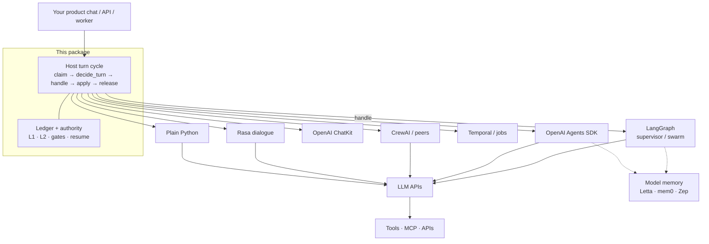

# Conversation Control Plane

*A durable, deterministic **turn-ownership ledger** for multi-agent chat — portable across
execution runtimes.*

Package: `conversation-control-plane` · MIT · reference implementation by [Bot0.ai](https://bot0.ai)

---

Multi-agent **orchestration is real** — and maturing every day — in the tools people already use.
LangGraph supervisors and swarms, OpenAI Agents SDK handoffs, CrewAI crews, Rasa dialogue
management, OpenAI ChatKit sessions, Temporal workflows: all can route, hand off, checkpoint,
and keep a conversation going across multiple agents.

This package targets multi-agent products where **chat is long-lived** and **authority must stay
clear across specialists** — often as size and complexity grow. Typical shape: several
half-finished tasks in one thread, ordered steps *and* disordered detours, leave mid-stream and
resume later, sometimes across specialists that do not share one graph, dialogue model, or runtime.

**Product USP (control-authority dimensions we treat as first-class):**

1. **Cross-runtime** — same thread authority if `handle` is LangGraph, plain Python, Temporal, or a
   **human operator** tomorrow; only the execution leaf changes  
2. **Human in the loop** — human is the usual *conversation counterpart*; HITL gates and human
   dispatch are first-class control options, not afterthoughts  
3. **Multi-task chat thread** — foreground / suspended / complete ≠ abandon on one shared thread  

Hosted chat (e.g. ChatKit) and dialogue engines (e.g. Rasa) already own a **session**; orchestration
engines own **runs and jobs**. If one platform session and one runtime are enough, stay there. This
ledger is for product-owned authority that must **compose across** those layers.

Example shape: onboarding with one specialist, research or setup with another, support or reporting
with a third. Work is sometimes **ordered** (finish A before B) and sometimes **disordered**
(detour, jump topics, leave half-done, come back later). The product still needs to know what is
open, what is foreground, and how to continue — without re-deriving that from the full transcript
every time.

Those systems **do** track state — in-process, in a checkpointer, or in a store you plug in.
**DB-backed is not the differentiator.** LangGraph checkpointers, Rasa trackers, Temporal workflow
state, ChatKit sessions, and custom app tables all persist; ownership can live outside a single
agent.

What usually stays **coupled to one orchestration model** is the *meaning* of that state:

| System class | Strong at | Typical authority shape |
|---|---|---|
| **LangGraph** (incl. supervisor / swarm) | Multi-agent graphs, checkpoints, interrupts | Graph channels / checkpointer for **that topology** |
| **OpenAI Agents SDK · CrewAI · peers** | Handoffs, agent loops, tool routing | Handoff + session / crew context for **that runtime** |
| **Rasa** | Dialogue policies, stories, NLU → action | Tracker slots / dialogue state for **that bot** |
| **OpenAI ChatKit** | Hosted chat UI + agent session wiring | Platform session for **that product surface** |
| **Temporal** | Durable workflows, signals, retries | Workflow state for **that workflow type** |
| **App code** | Product-specific glue | Ad hoc flags — flexible, easy to diverge per specialist |

### Who owns the next turn? (granularity + dimensions)

Something always answers “who’s next.” **Which tool and state shape fit depends on the objective** —
progressing a graph run, running a durable job, holding a dialogue, or keeping multi-task authority
in a long product chat. Dimensions below name those objectives; no single layer owns all of them.

| Dimension | Meaning |
|---|---|
| **Node / step** | Next node, tool call, or activity *inside one run* |
| **Agent / role** | Which agent role is delegated *inside one runtime topology* |
| **Chat thread** | Shared conversation the user sees as one session (usually human-facing) |
| **Multi-task** | Several half-finished product tasks; suspend / resume / foreground |
| **Cross-runtime** | Same authority if `handle` is LangGraph, Python, Temporal, **or human** tomorrow |
| **HITL** | Human as conversation counterpart and/or gated approver / operator leaf |
| **Durable job** | Infra-level workflow instance, retries, timers, worker claim |

| Grain | What “who’s next?” means here | Framework / product examples | Node/step | Agent/role | Chat | Multi-task | Cross-runtime | HITL | Durable job |
|---|---|---|---|---|---|---|---|---|---|
| **Run step** | Next hop *inside one execution* (not which product task is open for the user) | **LangGraph:** next graph node · **Temporal:** next activity · **CrewAI:** next crew task step · plain tool-loop iteration | ✓ | — | — | — | — | optional | sometimes |
| **Runtime multi-agent** | Which *agent role* is delegated *inside one graph/crew topology* | **LangGraph** supervisor → worker subgraph · **langgraph-swarm** handoff · **CrewAI** manager → specialist role · **OpenAI Agents SDK** agent-as-tool handoff | ✓ | ✓ | sometimes | DIY | — | optional | sometimes |
| **Hosted chat / dialogue session** | Which *platform/bot session* this human is in (one surface, one vendor model) | **OpenAI ChatKit** thread · **Rasa** tracker / stories · Assistants-style conversation id · many helpdesk chat widgets | — | sometimes | ✓ | limited | — | ✓ user | — |
| **Long workflow job** | Which *durable job instance* is live (retries, timers, workers) — not chat foreground law | **Temporal** workflow id · Celery/RQ job · queue worker claim on a background job | ✓ | — | — | — | — | optional | ✓ |
| **Product chat-thread authority** | Which *product task* is foreground on a thread **you** own; suspend/resume; complete ≠ abandon; leaf can change | **This package** (`decide_turn`, `active_task`, pins, L1/L2) · host may still call LangGraph/ChatKit/Temporal *under* `handle` | — | via dispatch | ✓ | ✓ | ✓ | ✓ | via host claim |

✓ = first-class for that grain · — = not the primary model · *limited / DIY / optional / sometimes* = possible, not the native portable contract.

**How to read Examples:** each cell names **tools people use for that grain** — not competitors to “delete.” A product can use Temporal (job grain) *and* LangGraph (run grain) *and* this ledger (chat-thread grain) together.

#### Worth comparing (including ChatKit)

Yes — **ChatKit and peers are worth an explicit row.** They are the closest “chat thread” tools
people already buy. The cut is not “they lack chat”; it is **session grain vs product authority grain**.

| | ChatKit / hosted chat | Rasa / dialogue | LangGraph / CrewAI | Temporal | **This package** |
|---|---|---|---|---|---|
| **Sweet spot** | Hosted human chat + their agents | NLU → dialogue policies | Multi-agent runs inside one topology | Durable jobs | Product multi-task thread authority |
| **Chat session** | ✓ Platform-owned | ✓ Bot tracker | App / graph | — | ✓ App-owned ledger |
| **Multi-task foreground law** | Limited / app DIY | Limited | DIY on graph state | — | ✓ First-class |
| **Cross-runtime authority** | Bound to that platform | Bound to that bot runtime | Bound to that graph/crew | Job model, not chat law | ✓ `handle` is pluggable |
| **HITL** | User always; approvals vary | Forms / policies | Interrupts / tools | Signals | User + gates + human operator leaf |
| **Compose with others** | Stay in stack or export DIY | Stay in stack or export DIY | Execution leaf | Job leaf | Designed to sit **above** leaves |

When the objective is **run, role, or durable job**, use orchestration / workflow engines. When the
objective is a **hosted single-stack chat session**, ChatKit or Rasa may be enough. When the objective
is **product-owned multi-task authority** that must stay coherent **across runtimes and HITL**, this
ledger is the natural focus — compose with the tools above; do not replace them.

| Product question | Typical session / run answer | This ledger |
|---|---|---|
| What is **foreground** in the shared thread? | Implicit in session or graph topology | Explicit `active_task` + pins + phase |
| **Who may write** ownership next? | Platform rules, edges, manager prompts | **`decide_turn` single-writer**; specialists return transitions |
| Why did this **chat turn** route to X? | Platform traces / checkpoint / workflow history | Queryable projection + event journal (L1/L2) |
| Complete vs cancel? | Often one “clear” / end path | **`COMPLETE ≠ ABANDON`** as distinct contracts |
| Swap execution leaf (incl. human)? | Re-map that engine or platform’s state | Authority row stays; only `handle` changes |

**One-line USP:** session and run tools answer *who owns this ChatKit/Rasa session or this graph/job
step*; this package answers *who owns the foreground product task on a thread that may span
runtimes and human gates* — as typed fields your host, UI, and tests can obey without deserializing
a whole run or locking to one chat platform.

This package is that **ledger**: durable, single-writer, with an event journal. On the authority
path, **code** decides what is foreground (`decide_turn`) — not a model guessing the next speaker.
The ledger only tracks **which conversational task is in front** across turns and specialists.
Everything else in the stack stays yours:

| Concern | Examples (keep these) | Not this package |
|---|---|---|
| **Orchestration** | LangGraph, OpenAI Agents SDK, CrewAI, Rasa, ChatKit, plain Python | We don’t replace multi-agent routing *inside* a runtime |
| **Durable work** | Temporal, job queues | We don’t own retries / timers / activities |
| **Prompts** | Prompt registries, LangSmith / Helicone-style hubs, your publish pipeline | We don’t store or version prompt text |
| **Tools** | Tool registries, **MCP** servers, OpenAPI actions, domain APIs | We don’t define callable schemas |
| **Model memory** | Letta, mem0, Zep, RAG corpora | We don’t own what the model *recalls* |
| **Models** | OpenAI, Anthropic, local endpoints, gateways | We don’t call models on the authority path |

> **Compose, don't rip-and-replace.** The ecosystem is diverse — orchestration runtimes, dialogue
> engines, hosted chat (ChatKit), durable workflows, prompt registries, tool/MCP layers, model
> memory. Keep them. This plane only owns **cross-turn conversational authority** (foreground task,
> gates, resume, audit) so lifecycle is not locked to one product’s state shape.

**What the ledger makes first-class (often embedded in one of the layers above):**

- **Durable across sessions** — control state survives the HTTP request, the worker restart, and
  the week — not only one graph or dialogue run.
- **Interruptible** — detour, suspend, resume. Complete and abandon are different contracts
  (`COMPLETE ≠ ABANDON`).
- **Deterministic authority** — models interpret meaning; code owns transitions and gates.
- **Provable** — thin projection (L1) + event journal (L2). Query *why this turn routed here* in
  the SQL store you already run.

**Not a full-stack framework** for multi-agent products, and **not** a layer meant to swallow the
ecosystem around it (orchestration, prompts, tools/MCP, memory, models). Those stay where they are —
compose table above · [stack map](#where-we-sit-in-the-stack) below. This package owns one slice:
**conversational authority**.

### Where we sit in the stack

```text
  Your product chat / API / worker
              │  implements the cycle below
              ▼
  ┌─────────────────────────────────────────────┐
  │  Host turn cycle          ← this package    │
  │  claim → decide_turn → handle → apply → release │
  │  (handle, single-writer, per conversation)  │
  ├─────────────────────────────────────────────┤
  │  Ledger + authority        ← this package    │
  │  L1 projection · L2 journal · gates · resume│
  │  conversational authority (who is foreground)│
  └─────────────────────────────────────────────┘
              │  handle dispatches into
              ▼
  ┌─────────────────────────────────────────────┐
  │  Orchestration  (keep / mix)                 │
  │  LangGraph · Agents SDK · CrewAI · Rasa     │
  │  ChatKit · plain Python · Temporal / jobs   │
  └─────────────────────────────────────────────┘
              │  uses
              ▼
  ┌─────────────────────────────────────────────┐
  │  Prompts · tools / MCP · models · domain DB │
  │  Model memory: Letta / mem0 / Zep (theirs)  │
  └─────────────────────────────────────────────┘
```



| Layer | Examples | Owns |
|---|---|---|
| **Product host** | Your API / worker | Wire transport; run the turn cycle |
| **Host turn cycle** | **This package** | `claim → decide_turn → handle → apply → release` |
| **Ledger + authority** | **This package** | Foreground task, gates, phase, suspend/resume, journal |
| **Orchestration / execution** | LangGraph, Agents SDK, CrewAI, Rasa, ChatKit, plain Python | Multi-agent routing *inside* a runtime; specialist work |
| **Durable work** | Temporal, your job queue | Retries, timers, long-running activities (optional) |
| **Model memory** | Letta, mem0, Zep | What the *model* can recall — not system authority |
| **Models & tools** | LLM providers, MCP, domain APIs | Tokens and side effects |

Same Postgres can hold a LangGraph checkpointer **and** this ledger — different questions:

| Store | Answers |
|---|---|
| **Checkpointer** | What was graph state at step N? |
| **This ledger** | Why did this **turn** route here, and what task is foreground? |

Deep dive: [Why this exists](#why-this-exists) · [§14 ecosystem layering](docs/conversation-control-plane-sdk.md#14-ecosystem-layering--langgraph-crewai-temporal-and-the-control-plane).

### Quickstart (5 minutes)

```bash
git clone https://github.com/walidnegm/conversation-control-plane.git
cd conversation-control-plane
pip install -e ".[dev]"
pytest tests/ -q
python examples/e2e_host_loop.py
```

```python
from conversation_control_plane import (
    TurnPlan, TaskTransition, strip_control_keys, get_kind_spec, decide_turn,
)

# Host loop idea: claim → decide_turn → agent.handle → apply_transition → release
# Specialists return TaskTransition; strip_control_keys on agent context_updates.
```

Lookup: [design principles](#on-ramp--how-to-think-about-this-package) · [contract](docs/conversation-control-plane-sdk.md) · [lifecycle diagram](docs/conversation-turn-lifecycle-diagram.md) · [stack map](#where-we-sit-in-the-stack)

**Naming:** *conversation control plane* is the short brand; plain terms: **turn-ownership ledger**
(foreground task, gates, resume). It sits **above** agent runtimes — compose, don’t replace.
See the [stack map](#where-we-sit-in-the-stack) and [§14](docs/conversation-control-plane-sdk.md#14-ecosystem-layering--langgraph-crewai-temporal-and-the-control-plane).

---

## Why this exists

Most orchestration and agent frameworks **contain** conversational control logic — but it is usually
**embedded** in their primary abstraction:

| Framework / place | Where ownership is buried |
|---|---|
| **LangGraph** | Graph state, nodes, edges, interrupts, checkpoints |
| **Agent SDKs** | Handoffs, routers, tool calls, conversation context |
| **Temporal** | Workflow state, signals, workflow code |
| **App code** | Controllers, prompts, session objects, ad hoc flags |

We **splice that responsibility out** into an independent control plane — see the
[stack map](#where-we-sit-in-the-stack) above.

**Not the claim:** “Other systems cannot manage conversational state.”  
**The claim:** Other systems usually treat conversational **ownership and lifecycle** as implementation
details of an agent, graph, or workflow. This package makes them an **independent, authoritative,
portable system contract** — so authority survives changes in the execution layer.

The **same conversational task** can run via a direct agent call today, a LangGraph subgraph tomorrow,
a Temporal workflow for long-running work, a human operator, or a deterministic service — without the
control plane changing **who is foreground** merely because the **execution mechanism** changed.

### Four concerns (usually collapsed)

| Concern | Owner in this design |
|---|---|
| **Semantic interpretation** — what does the user mean? | LLM / agent |
| **Conversational authority** — which task, gate, phase is foreground for the turn? | **This package** |
| **Execution orchestration** — which nodes, tools, activities run? | LangGraph / agent runtime / your code |
| **Durable execution** — retries, timers, worker recovery | Temporal / infra (optional) |

A typical framework combines two or three of these. Separating them is the architectural contribution.

**Rule (convention + boundary strip):** classifiers propose labels; **`decide_turn` / host** should be the only writers of control keys. Specialists return `TaskTransition`; `strip_control_keys` removes control keys from agent `context_updates`. This is **not** a hard runtime sandbox — an agent that imports the ledger can still write; treat that as a host policy violation.

Full write-up: [contract §0](docs/conversation-control-plane-sdk.md#0-value-proposition--conversational-control-in-a-layered-stack) · [§14 ecosystem](docs/conversation-control-plane-sdk.md#14-ecosystem-layering--langgraph-crewai-temporal-and-the-control-plane).

### Authority path is deterministic (not “zero LLM in the whole folder”)

**Honest framing:** the **authority hot path** — ledger writes, turn claims, revision fencing,
phase/pin gates, COMPLETE vs ABANDON journal types, and the pure branches of `decide_turn` — is
**deterministic code**. It does **not** call a model to decide who owns the thread.

| Layer | LLM? |
|---|---|
| Semantic interpretation (your classifiers / tools) | Optional — feeds **enums** into the plane |
| **Authority hot path (this package)** | **No model call** |
| Host product classifiers (Bot0 monorepo) | Optional, **outside** this package |
| Specialist execution (LangGraph / agent loop) | Optional — your product |

You can drive turns from a UI button, finite menu, test harness, or `examples/e2e_host_loop.py`
with **no LLM at all**. Authority is not another prompt.

---

## Traction pillars — honest status

Community adoption lives or dies on three questions. Here is the contract answer for each.

### 1. Scale — concurrent chats without a global lock

**Question:** does DB-authoritative control become a locking bottleneck at high concurrency?

**Model (by design):** the isolation unit is **one conversation row**, not a global agent table.

| Mechanism | Behavior |
|---|---|
| **Turn claim** | At most one live turn per conversation (`_turn_claim`). Second send → busy / reject-don't-queue. **Default fail-closed** on infrastructure errors (`TurnClaimInfrastructureError`); opt-in `fail_open_on_error=True` only for deliberate degraded hosts |
| **Optimistic revision** | `_control_revision` + optional `expected_version` fence (`StaleControlRevisionError`) |
| **Short critical section** | Read projection → **LLM/specialist work off DB** → short TX: fence · `command_id` · projection · journal · commit |
| **Row locks** | `SELECT … FOR UPDATE` only on multi-key lifecycle writes — not for the duration of the LLM call |
| **Orphan steal** | Claim TTL + heartbeat renew; crashed worker does not wedge the thread forever |
| **Horizontal workers** | Many API workers; contention is **per conversation**, not cluster-wide |
| **Host envelopes** | `turn_timeout` (inline wall-clock), `turn_session_discipline` (claim after session boundary), `session_staleness` (idle Resume / Start Fresh) — long-turn law; job poll UI stays host |

**What “10k concurrent users” means here:** 10k *conversations* can progress in parallel. What you must *not* do is two writers racing the **same** conversation without a claim — that is a correctness bug, not a scale feature.

| Shipped | Open |
|---|---|
| Locking contract in [SDK §3.1 Q1](docs/conversation-control-plane-sdk.md#31-three-hard-questions-the-contract-must-answer) | Packaged k6/locust **benchmark numbers** in CI |
| Multi-worker **smoke procedure** + regression pins | Public published latency/throughput dashboard |

See also monorepo scale smoke (procedure, not a load framework) when developing against the reference host.

### 2. Day-2 operations — SQL-native visibility

Control state is **SQL-native**, so ops visibility is a query — not a proprietary runtime.

| What you can read today | API / shape |
|---|---|
| Who owns the thread | `get_control_state` → `active_task`, `suspended_tasks`, `pending_switch`, `control_revision` |
| Lifecycle history (L2) | `conversation_control_events` journal (`task_id`, `command_id`, `seq`, complete vs abandon) |
| Why routing chose X | Per-turn routing trace fields (join on `conversation_id` + revision) |

**Minimal ops query (sketch):**

```sql
-- Active sessions: who holds the token, which phase, revision
SELECT conversation_id, tenant_id,
       context->'active_task' AS active_task,
       context->'_control_revision' AS rev,
       context->'_turn_claim' AS turn_claim
FROM conversations
WHERE context ? 'active_task'
ORDER BY updated_at DESC
LIMIT 50;
```

| Shipped | Open (community-facing) |
|---|---|
| Contract + lifecycle diagram for “where am I stuck?” | Lightweight **`ccp inspect`** CLI (terminal) |
| Trace export sample (OTel/Langfuse wiring in monorepo docs) | Optional **React session viewer** on the same schema |

We deliberately **do not** ship graph Studio inside the ledger package — pipe traces to your observability vendor; keep the control plane small.

### 3. Streamlined integrations — wrap the agent, don't rewrite it

**Question:** do teams have to rewrite agents for a new package?

No. **This is not the agent.** It is a thin host loop around whatever you already run.

| Integration | Pattern | Example |
|---|---|---|
| **LangGraph** | Graph runs *inside* `handle_turn`; ledger owns thread ownership | [examples/integrations/wrap_langgraph.py](examples/integrations/wrap_langgraph.py) |
| **OpenAI-style tool loop** | Assistants / chat.completions loop returns a transition | [examples/integrations/wrap_openai_loop.py](examples/integrations/wrap_openai_loop.py) |
| **Raw Python `while`** | Minimal host: claim → decide → agent → apply | [examples/integrations/wrap_python_loop.py](examples/integrations/wrap_python_loop.py) |
| **Bounded specialist shape** | Full multi-turn kind + phases | [examples/cyber_risk_assessment/](examples/cyber_risk_assessment/) |

Dead-simple host shape (~10 lines of *idea*):

```python
# Host owns ledger writes. Agent never imports ledger.py.
claim_turn(db, tenant_id, conversation_id, holder=worker_id)
try:
    plan = decide_turn(context, router_labels)          # who owns this turn?
    result = agents[plan.agent].handle_turn(query, context=context)
    apply_transition_request(db, ..., result.transition)  # sole writer
    return result.answer
finally:
    release_turn_claim(db, tenant_id, conversation_id, holder=worker_id)
```

---

## On-ramp — how to think about this package

The **contract document is the spec** (lookup). This README is the **on-ramp**: design principles, setup,
and a kickoff prompt that puts coding agents in the right shape. Optional code under `examples/`
saves tokens when useful — agents can generate a specialist from the principles alone.

### Design principles (stable)

These held under production multi-agent chat. Build against them; do not invent a second authority path.

| Principle | Contract |
|---|---|
| **This is not the agent** | Keep Layer 1 execution (LangGraph, Crew, tools, Temporal). The ledger owns **who holds the thread**. |
| **Authority path is deterministic** | Ledger / claim / COMPLETE≠ABANDON / pure `decide_turn` branches call **no model**. Host classifiers sit optional **around** the plane. |
| **Cognition ≠ execution** | LLM proposes **enums** / structured labels. Code owns transitions, side effects, and user-visible structure. |
| **Single writer** | Agent returns `TaskTransition`. **Only** host / `decide_turn` writes control keys (`active_task`, …). |
| **Projection is thin** | Pins + phase + `pending_ref`. Domain depth lives in a **specialist store**, not conversation context JSON. |
| **Identity is pinned** | After pin, **payload ids** are authority. Phase gates greenfield resolve; ambient `last_read_*` is not sole identity. |
| **COMPLETE ≠ ABANDON** | Success and cancel are distinct journal reasons / event types — never the same clear path. |
| **Locks are per conversation** | Short TX + turn claim; LLM work **off** the row lock. Many conversations progress in parallel. |
| **Finite grammar only when armed** | Numbered picks / approve only if a menu or gate was **set** for this turn. |
| **Compose, don’t rip-and-replace** | Graph / checkpoint for mid-turn execution; ledger for cross-turn ownership. Use both when both questions matter. |

**Four multi-turn invariants:** phase owns dispatch · pin owns identity · LLM owns continue meaning · finite grammar only when armed.

### Writing a specialist (checklist)

**You own the machine.** The ledger records ownership; it does not run your product
phases. Each specialist must implement **its own** finite machinery — legal next
step, honest CTAs, advance on confirm (not silent redisplay). If the surface
advertises “continue to staffing” while the gate still requires “confirm fixes,”
that is a **specialist bug**, not a ledger bug. Full note:
[Host transition discipline §0](docs/host-transition-discipline.md#0-specialists-own-their-own-machinery).

| Step | Shape |
|---|---|
| **Register a kind** | Closed enum + `KindSpec` phases — not free-text kinds from RAG |
| **Start the stream** | `begin_task` — host assigns `task_id` (not “tool succeeded” as ownership) |
| **Pin identity** | Typed ids on the thin payload |
| **Phase owns dispatch** | Entity resolve only in open / pick phases — not re-resolve by name on every continue |
| **Honest surface** | Primary CTA matches current phase — do not advertise the *next* step while this phase is still blocking |
| **Handoffs** | Declare begin / continue / complete / abandon; agent never imports `ledger.py` |
| **Thin projection** | Pins + phase + `pending_ref` only |

Helpers: `src/conversation_control_plane/multi_turn_stream_contract.py`.  
Optional shape reference: [examples/cyber_risk_assessment/](examples/cyber_risk_assessment/) (scaffold, not product scoring).

### Minimal setup

1. Map your chat store to a **control slice** (`active_task`, `suspended_tasks`, `pending_switch`, `_control_revision`, optional journal table).  
2. `pip install -e ".[dev]"` then import from `conversation_control_plane` (or reimplement against the SDK contract).  
3. Host loop: `claim_turn` → router labels → `decide_turn` → `handle_turn` → `apply_transition` → `release_turn`.  
4. Register each multi-turn **KindSpec**; first sticky turn **begin**; keep domain working state off-projection.  
5. Pin five tests: continue resumes · complete clears · abandon ≠ complete · no auto-switch · **no re-resolve after pin**.  
6. Run `python examples/e2e_host_loop.py` then optional cyber `host_sketch.py` for dialogue shape.  
7. Read **[Host transition discipline](docs/host-transition-discipline.md)** — every result names begin/continue/complete/abandon/none; **reorient ≠ COMPLETE**; how to seal a new kind (laws vs goldens).

Lookup when stuck (not cover-to-cover): SDK **Getting started** · **§2.1** multi-turn · **[host transition discipline](docs/host-transition-discipline.md)** · **§3.1** concurrency · **§5** invariants · **production-grade L2**.

### Coding-agent kickoff (paste this)

```text
You are integrating the Conversation Control Plane SDK — the production state layer
for multi-agent chat. It is NOT a LangGraph/CrewAI/Temporal replacement. You keep
our existing agent runtimes; you add DB-authoritative turn ownership.

SOURCE OF TRUTH (clone / read this repo first):
- GitHub: https://github.com/walidnegm/conversation-control-plane
- Package name: conversation-control-plane  (local: `pip install -e ".[dev]"` from clone; PyPI install is future)
- Publisher: Bot0.ai — public repo is the adopter-facing surface

PRIMARY ON-RAMP (in that repo):
1) README.md — "On-ramp — how to think" (design principles + specialist checklist + setup)
2) README.md — value prop + traction pillars (scale / Day-2 / wrap) if relevant
3) OPTIONAL: examples/cyber_risk_assessment/ only if you need a shape pin
   (KindSpec, thin payload, host sole writer, VERIFY human_approval). Full product
   agent code is unnecessary — generate our specialist from the design principles.

SDK doc = SPEC for lookup when a rule is unclear:
  docs/conversation-control-plane-sdk.md
- §2.1 multi-turn stream, §3.1 concurrency, §5 invariants, production-grade L2 (task_id,
  command_id, COMPLETE≠ABANDON, thin payload, KindSpec). Use §1.1 if you need the long brief.

BUILD AGAINST THESE PRINCIPLES:
- Classifiers propose labels; decide_turn enforces. Specialists return TaskTransition only.
- Never write active_task from the agent. Never invent task_id after begin.
- Thin projection: pins + phase + pending_ref. Domain working state in specialist store (P15).
- Register KindSpec before begin. Phase owns dispatch; pin owns identity.
- No phrase-laundry wordlists for NL meaning; finite grammar only when a gate/menu is armed.
- Host: claim_turn → decide_turn → handle_turn → apply_transition → release_turn.
- Per-conversation isolation — not a global lock; LLM work off the short ledger TX.

DO NOT:
- Parallel *_active / *_phase flags fighting the ledger
- Ambient last_read_* as sole identity after pin
- Full domain artifacts stuffed into control payload
- Cancel implemented as complete
- COMPLETE on idle reorient / Resume gate / status ask (those are continue or none)
- Infer COMPLETE from missing agent_type or empty context_updates
- Keyword routing as sole arbiter of user meaning
- Re-resolve entity by name on every continue turn

HOST TRANSITION DISCIPLINE (docs/host-transition-discipline.md):
- Specialists own their own phase machine; ledger only records honest transitions
- Surface must not lie about phase (no "next step" CTA while this phase still blocks)
- Every ownership-affecting result names transition: begin|continue|complete|abandon|none
- New multi-turn kind: KindSpec + pins + legal COMPLETE moments; 1–3 Conjecture scripts
  for THAT kind (portable templates — not another product's goldens)

DELIVER:
1) Port ledger + decide_turn to our conversations store
2) One sole-continue kind (our domain) following the specialist checklist
3) Five tests: resume, complete, abandon≠complete, no auto-switch, no re-resolve after pin
```

Longer bootstrap (only if needed): SDK [§1.1 adopter brief](docs/conversation-control-plane-sdk.md#11-adopter-brief-copy-to-your-coding-agent).

---

## When the value prop is strong enough to adopt

Honest fit check — **this is not for everyone.**

### Adopt when

You have (or anticipate) **multiple agents/specialists** with handoffs, phases, approvals, or long-lived tasks.  
You value **SQL queries for ops/debugging** over proprietary workflow UIs.  
You’re hitting **concurrency, stuck sessions, or audit** issues (“why did this route to X?”).  
You want to **mix execution styles** (Python today, LangGraph tomorrow, Temporal for long work) without rewriting control logic.  
Your app **already uses Postgres** (or similar SQL) for chat history.

**Adoption cost: moderate.** You add a thin host loop  
`claim → decide_turn → execute → apply_transition → release`.  
Agents return structured transitions; they **do not** import the ledger. The control plane has **0 inherent LLM calls**.

### When it’s not worth it yet

- **Simple single-agent or graph-only flows** — LangGraph (or a plain tool loop) is enough.  
- **You’re all-in on Temporal for everything** — don’t add a second authority plane unless chat ownership is a distinct pain.  
- **Early prototype stage** — this is overkill until multi-specialist stickiness shows up.  
- **You prefer minimal dependencies** and a fully polished package — this repo is still **early** (public contract stable; PyPI / full host adapters, formal load numbers, and Day-2 UI productization are **future** work).

If you’re unsure: start with the [On-ramp](#on-ramp--how-to-think-about-this-sdk) kickoff and the cyber `host_sketch.py` dialogue. If that shape feels like busywork for your product, **skip**.

---

## Core features (what the code actually pins)

- **Projection + journal shapes** — `active_task`, `suspended_tasks`, `pending_switch`, `_control_revision`, turn claims; L2 event types include `task_completed` vs `task_abandoned`
- **`decide_turn`** — portable dispatcher (full DB host optional); exact **reset → abandon** path wired
- **`strip_control_keys` / `TaskTransition`** — single-writer **convention** + boundary strip
- **Revision fence + `command_id` idempotency** — real in `ledger.py` / `ledger_journal.py` when a SQL host is present
- **Multi-turn stream + KindSpec** — phase/pin contracts for sole-continue kinds
- **Not claimed for bare extract:** global fail-closed claim under every DB error; zero LLM in every monorepo sibling module; PyPI production SLA / load numbers

---

## Developer artifacts (intentionally small)

| # | Artifact | Role |
|---|---|---|
| 1 | **This README — On-ramp** | Design principles, setup, **kickoff prompt** (primary for humans + coding agents) |
| 2 | **[SDK contract](docs/conversation-control-plane-sdk.md)** | Spec for lookup — not a cover-to-cover tutorial |
| 3 | **[Cyber scaffold](examples/cyber_risk_assessment/)** | Optional shape pin / token saver — not required if the agent can generate from principles |

No separate playbook. Optional wrap sketches: Traction §3 + `examples/integrations/`.

## Repository layout

| Path | What it is |
|---|---|
| [`src/conversation_control_plane/`](src/conversation_control_plane/) | Installable package (no top-level `api` namespace) |
| [`docs/`](docs/) | SDK contract + lifecycle diagram (reference host notes) |
| [`examples/e2e_host_loop.py`](examples/e2e_host_loop.py) | **Runnable** host loop + COMPLETE≠ABANDON journal demo |
| [`examples/cyber_risk_assessment/`](examples/cyber_risk_assessment/) | Optional specialist scaffold + in-memory host sketch |
| [`examples/integrations/`](examples/integrations/) | Wrap sketches (pseudocode — not E2E product integrations yet) |
| [`tests/`](tests/) | Portable contract tests (`pytest tests/`) |
| [`LICENSE`](LICENSE) | MIT |

```bash
pip install -e ".[dev]"
pytest tests/ -q
python examples/e2e_host_loop.py
```

---

## Status (humble)

| Shipped | Not shipped / honest gaps |
|---|---|
| MIT license + installable `conversation_control_plane` package | Formal load **benchmark** numbers |
| In-repo `pytest` pins + runnable `e2e_host_loop` | Full SQL host adapter as a one-liner `pip` experience |
| Real fencing / `command_id` / COMPLETE≠ABANDON **in source** | Every monorepo host path is fail-closed out of the box |
| Design principles + SDK contract for lookup | Thin 200-line quickstart replacing the long SDK doc (follow-on) |
| SQL-native **ops read model** (query the projection) | `ccp inspect` CLI / session viewer |

This is an **early** portable contract + reference code, not a LangGraph/Temporal replacement.
Prefer the narrow edge: queryable ownership, single-writer convention, gate-vs-mid-flight.

---

## Maintainers

Publish from the Bot0 monorepo:

```bash
./scripts/publish_control_plane_public_repo.sh --repo /path/to/clone --push
```

---

## License

MIT — see [LICENSE](LICENSE).
