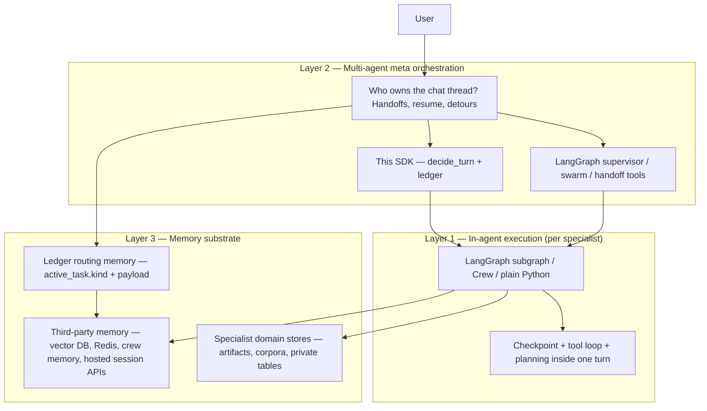
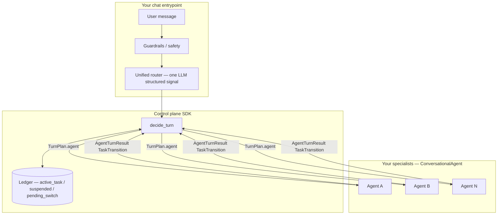
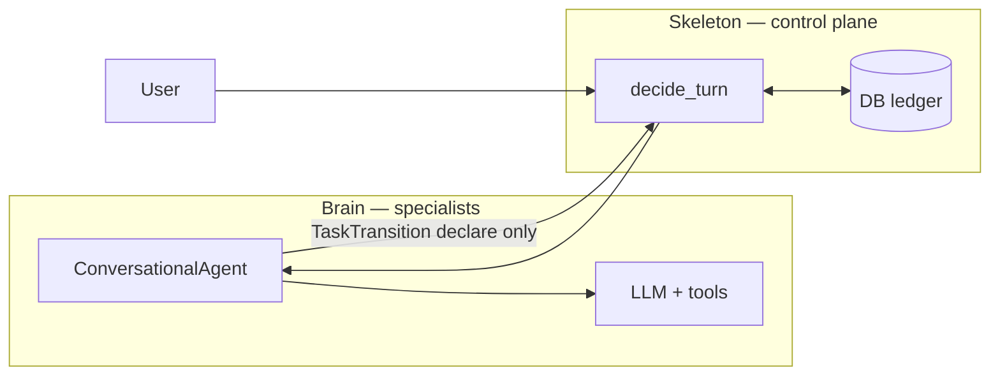
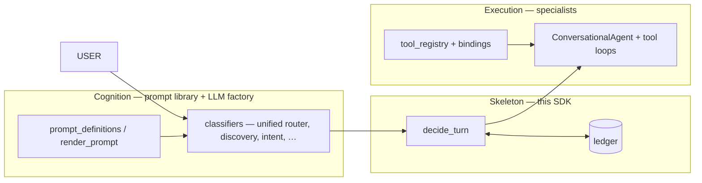
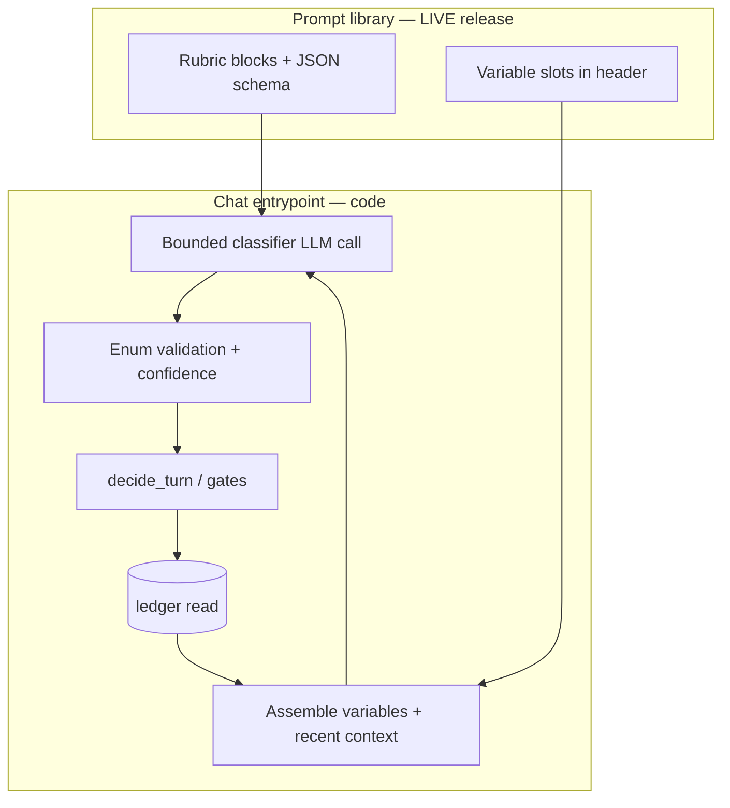
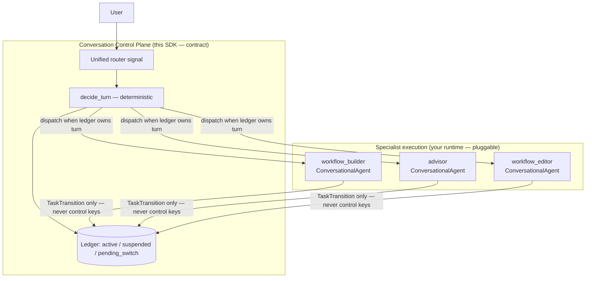

# Conversation Control Plane SDK — reference implementation by Bot0.ai

| Field | Value |
|---|---|
| **Full name** | Conversation Control Plane SDK |
| **Short name** | Control Plane SDK |
| **Publisher** | [Bot0.ai](https://bot0.ai) |
| **Public repository** | **[github.com/walidnegm/conversation-control-plane](https://github.com/walidnegm/conversation-control-plane)** — public SDK home |
| **Role** | Reference implementation (Bot0 monorepo today) + **public repo** (extraction destination) + integration contract (this document) |
| **Citation** | *Conversation Control Plane SDK* (reference implementation by Bot0.ai). Public repo: `https://github.com/walidnegm/conversation-control-plane`. Integration contract: `docs/conversation-control-plane-sdk.md` |
| **Code identity** | `api/services/conversation_control/sdk_identity.py` |
| **Future package slugs (Phase 1b)** | PyPI `conversation-control-plane` · npm `@bot0/conversation-control-plane` — **not published yet** |

Status: Living reference implementation (2026-07-07) — **integration contract available now**; **public repo scaffolded**; standalone `pip install` in Phase 1b (§0.3)
Owner: Bot0 control-plane / conversation layer
Reference code: `api/services/conversation_control/` (+ specialist modules below — monorepo-embedded today; syncs to the public repo)
License / distribution: **Public GitHub repo** — early extraction; package registry publish still Phase 1b

### Getting started — core concepts in five minutes

**What this is.** A **conversation control plane**: a database-backed ledger plus a `decide_turn` dispatcher
that owns multi-specialist chat — who is foreground, what task is active, when to hand off or resume. Your
specialists implement `ConversationalAgent`; they declare `TaskTransition`; they never write routing state.

| Concept | One-line meaning |
|---|---|
| **Ledger** | `active_task`, `suspended_tasks`, `pending_switch` — versioned control slice your DB owns |
| **`decide_turn`** | Deterministic dispatcher — sole writer of control keys; returns a `TurnPlan` per turn |
| **`ConversationalAgent`** | Specialist contract — `handle_turn` owns domain logic; control plane owns ownership |
| **Routing trace** | Per-turn record of *why* agent X got the turn — SQL/query friendly (§11.1) |

**Fit check (one screen):** [README](../README.md).

**Minimum integration path**

1. Map your agents to §9.1 patterns → implement `ConversationalAgent`.
2. Wire chat: message → router signal → **`decide_turn`** → dispatch specialist.
3. Pin §5 invariants in tests (continue resumes; no auto-switch; terminal completion clears `active_task`).

**Go deeper:** §1 bootstrap checklist · §5 invariants · §14 ecosystem layering (if you already use LangGraph, CrewAI, or Temporal).

### Architecture documents (Bot0 monorepo — four canonical)

| Document | Role |
|---|---|
| **This SDK** | Portable contract (you are here) |
| [conversation-turn-lifecycle-diagram.md](conversation-turn-lifecycle-diagram.md) | One-turn code-grounded diagram |

Full index: .

**Layered stack, not a rip-and-replace.** Modern agent products combine tools from the ecosystem. LangGraph,
CrewAI, and Temporal are strong **execution** layers — graphs, crews, durable workflows. This SDK formalizes
the **conversation layer** above them: turn ownership, handoffs, resume semantics, routing audit. Bot0 builds
on those primitives; this document shows how to **compose** them. Full layering guide: §14.

### Adoption status

| Stage | What you can do today |
|---|---|
| **Public home (scaffold)** | [github.com/walidnegm/conversation-control-plane](https://github.com/walidnegm/conversation-control-plane) — reference code + docs synced; **monorepo remains authoritative** until `pip install` (Phase 1b) |
| **Contract (now)** | Port ledger semantics and wire `decide_turn` against your conversations store |
| **Reference code (now)** | Study `api/services/conversation_control/` in the Bot0 monorepo (sync source for the public repo) |
| **Package (Phase 1b)** | `pip install` / `npm install` — milestone in §15 |

The contract is **stable enough to design and integrate against today**. The published package boundary is the
remaining adoption convenience — not a blocker on reading, porting, or regression-pinning the semantics.

### Document map — public contract vs Bot0 implementation

| You are… | Read this |
|---|---|
| **Evaluating or porting the ledger** | **This document** — contract, invariants, bootstrap, honest limits (§0.7), external review notes (§0.8) |
| **One-screen fit / README distill** | [README](../README.md) — adopt vs skip, LangGraph compose summary |
| **Loop or stuck-thread incident** | [SDK §3.1 — loops & stuck threads](conversation-control-plane-sdk.md#31-three-hard-questions-the-contract-must-answer) — symptom → diagnosis → contract fix |
| **Observability / trace export** | [SDK §11.1 — routing trace](conversation-control-plane-sdk.md#111-intent-router-layers-l0l4-and-per-turn-routing-trace) — `Bot0RoutingTrace` + OTel/Langfuse wiring |
| **Multi-worker scale proof** | [SDK §3.1 Q1 — turn claims](conversation-control-plane-sdk.md#q1--concurrency--locks-who-owns-the-turn) — turn-claim soak + regression anchors |
| **New here — start above** | **Getting started** (this section) → README → §1 bootstrap |

### 0.0 Naming and attribution (how to refer to this in docs and READMEs)

Open-source projects usually separate **what the thing is called**, **who maintains the reference
code**, and **where the contract lives**. This project follows that split:

| OSS pattern | Example elsewhere | How we map it |
|---|---|---|
| **Vendor SDK** | Temporal Go SDK, Vercel AI SDK | **Conversation Control Plane SDK by Bot0.ai** — the product name adopters cite |
| **Spec + reference implementation** | OpenTelemetry Specification + language SDKs | **This document** = integration contract (spec); **`api/services/conversation_control/`** = reference implementation |
| **Short informal label** | "the OTel SDK", "LangGraph" | **Control Plane SDK** — fine in internal docs; prefer the full name in papers, READMEs, and package metadata |
| **Future package install** | `pip install temporalio`, `@vercel/ai` | Reserved slugs only until Phase 1b: `conversation-control-plane` / `@bot0/conversation-control-plane` |

**Recommended README line (public repo + monorepo mirror):**

```text
Conversation Control Plane SDK — reference implementation by Bot0.ai
https://github.com/walidnegm/conversation-control-plane
Integration contract: docs/conversation-control-plane-sdk.md (Bot0 monorepo; syncs to public repo)
```

**Do not imply** `pip install` / `npm install` works until Phase 1b (§15 extraction gate) clears.
Until then, star/clone the **public repo**, cite the spec path and vendor attribution; wire reference code via monorepo import, public repo checkout, or port.

Canonical string constants (for tooling, tests, generated headers): `sdk_identity.py`.

---

## 0. Value proposition — conversational control in a layered stack

Developers building multi-agent chatbots already stand on a rich ecosystem — LangGraph for graphs, CrewAI for
crews, Temporal for durability, Postgres for persistence. The layer this SDK owns is narrower and load-bearing:
**cross-agent session lifecycle** in chat (resume, suspend, handoff, detour, gate semantics). Execution
frameworks excel at *how a specialist runs*; this contract excels at *who owns the conversation*.

### 0.1 Core pillars

| Pillar | What it is | Why it matters |
|---|---|---|
| **Publishable ledger** | Every turn, control mutation, and handoff is a **DB record** — `active_task`, `suspended_tasks`, `pending_switch`, `_control_revision`, `_turn_claim`, platform events | Server crash mid-thought does not erase state. Audit *why* routing chose X: the proof is in the ledger, not a vanished in-memory checkpoint |
| **Control plane** | `decide_turn` + `ledger.py` — the **only writer** of control keys; specialists **declare** `TaskTransition`, they never route | The LLM does not fragile-call `route_to_billing()`. It emits a structured handoff *request*; the control plane **enforces** Switch/Stay, precedence, TTL, and single-writer rules |
| **Strict contract** | `ConversationalAgent`, `TurnPlan`, typed envelopes, five invariants, regression harness | Human teams and auto-coders integrate against **types and precedence**, not tribal knowledge of a tangled graph — fewer silent breaks on every new agent |

### 0.1.1 Three-layer model of an agentic system

Production agent stacks are usually **three layers deep**. Framework marketing often collapses them; this SDK
names them so you can compose without guessing which store owns which question.



| Layer | Typical hosts | Owns | Does *not* own |
|---|---|---|---|
| **1 — In-agent execution** | LangGraph node/subgraph, Crew task loop, Temporal activity behind an adapter, plain `handle_turn` | Planning, tools, IR pipelines, **mid-turn** checkpoint/resume *inside* one specialist | Which specialist is foreground in the **shared chat thread** |
| **2 — Multi-agent meta** | LangGraph supervisor/swarm **or** this control plane (`decide_turn` + ledger) | Turn ownership, Switch/Stay handoffs, suspend/resume across specialists, routing audit | Tool-loop mechanics inside a specialist |
| **3 — Memory** | Postgres ledger slice, vector/RAG vendors, Redis, crew memory, Letta-style session APIs, your OLTP | **Varies by store** — see below | One universal memory blob (anti-pattern) |

**Layer 2 — two valid patterns (compose, don't conflate):**

| Pattern | When it fits | Tradeoff |
|---|---|---|
| **Graph-native meta** | Research graphs, rapid topology edits, single product surface per subgraph | Supervisor edges can steal turns unless you add explicit session semantics |
| **Ledger-native meta (this SDK)** | Long-lived **chat** with several specialists, compliance on routing, multi-worker API | More contract ceremony; execution still pluggable underneath |

Bot0 uses **ledger-native meta** for product chat and **LangGraph (or plain Python) inside** specialists for
execution — not either/or.

**Layer 3 — memory is plural, not one product:**

| Memory class | Owner | Examples | Routing / control plane uses it? |
|---|---|---|---|
| **Routing + working memory** | **Ledger** (`active_task`, `payload`) | Drafting phase, gate flags, `intake_seed`, IR checkpoint mid-flow | **Yes** — canonical for cross-turn routing (§3.1 Q3) |
| **Classifier hydration** | Code renders ledger facts + bounded recent transcript | `{drafting_context}`, `{active_task}`, `recent_context.py` | **Feeds** routing cognition; not a second source of truth |
| **Third-party / vendor memory** | External or app-chosen store | Vector RAG, crew snapshots, Redis session, hosted memory APIs | **No** for control keys — specialists may read/write; ledger still owns foreground |
| **Domain depth** | Specialist + your data model | Workflow pending rows, assessment artifacts, tenant corpora | **No** — loaded selectively per `handle_turn` |

**Rules of thumb (v1 — refine as adapters mature):**

1. **Never** store `active_task` / `pending_switch` only in crew memory or a vector index — control keys stay
   ledger-single-writer.
2. **May** use third-party memory for retrieval and long-horizon recall; pass **pointers or summaries** into
   specialists, not routing authority.
3. **Same Postgres** can hold LangGraph checkpointer tables, ledger JSONB, and pgvector — different schemas,
   different questions (§0.4).

Full compose guide: **§14**. Hydration detail: **§3.1 Q3**.

### 0.2 What the conversation layer adds (on top of execution frameworks)

| Problem | In-memory / graph-default posture | This SDK |
|---|---|---|
| **Black box debugging** | Complex DAGs of nodes and conditional edges — hard to stream, hard to audit in real time | Frontend (or ops tooling) can **subscribe to the conversations row** / control slice and see `active_task`, `pending_switch`, `control_revision` change live |
| **State ephemerality** | Checkpoints and crew memory tied to process lifetime | Conversation as a **distributed transaction**: ledger survives worker death; async jobs re-claim and renew; `mark_turn_completed` stamps durable turn boundaries |
| **Deterministic handoffs** | Hope the agent remembers to call the right tool / edge | Session **ownership is explicit** in the ledger — `propose_switch`, `suspend_active`, `decide_turn` precedence; flaky classifier cannot auto-steal an active task |

| | **This SDK** | **LangGraph** | **CrewAI** |
|---|---|---|---|
| **Primary job** | Conversational control plane (ledger + dispatch) | General agent graph execution | Role-based crews |
| **Runtime weight** | Thin library you embed | Framework + checkpointer stack | Framework + crew abstractions |
| **State model** | DB-authoritative ledger, single-writer | Checkpoint serialization | Crew memory / snapshots |
| **Multi-agent handoff** | First-class (`pending_switch`, suspended tasks, TTL) | Conditional edges / interrupts | Manager delegation |
| **NL vs procedure** | Built-in split (classifier → enum; code owns transitions) | App-defined | App-defined |
| **Multi-worker / tenant** | Designed in (`FOR UPDATE`, `control_revision`) | Achievable, app-owned | Achievable, app-owned |
| **Invariants enforced** | Five explicit + regression harness | Flexible — app responsibility | Looser defaults |
| **Visualization / time-travel** | Not the focus (optional Phase-2 host) | Strong | Moderate |
| **Audit trail** | Platform events per ledger write + `control_revision` | Checkpointer history (graph steps) | App-owned crew memory |

**When to adopt this SDK**

- You have **multiple conversational agents** (builder, advisor, editor, …) sharing one chat thread.
- Users say "pick up where we left off," "switch to the other workflow," or detour mid-task — and you need
  that to be **stateful**, not re-inferred from text every turn.
- You want **cognition** (LLM classifiers) separated from **procedure** (deterministic ledger writes).
- You need something that runs as a **library inside your app** today, with an optional graph host later —
  without rewriting the contract.

**When LangGraph / CrewAI still fit**

- Single-agent tool loop with no cross-agent stickiness.
- Research prototypes where graph visualization and rapid topology edits matter more than ledger discipline.
- Teams that want a framework to own the entire execution loop day one.

**Already on LangGraph or CrewAI?** Keep them for execution — see **§14** for the layering diagram (specialist
runtimes pluggable under `decide_turn`). §0.4 explains why checkpointers and this ledger answer different
questions even when both use Postgres.

**The "more than lightweight" claim:** this is not only fewer dependencies. It encodes **product-hardened
semantics** — gate-vs-mid-flight, finite picks, fail-closed timeouts, de-competition of competing
classifiers — that teams otherwise rebuild inside LangGraph after production incidents.

### 0.3 What ships today vs the extraction milestone

| Today (monorepo reference + public repo scaffold) | Extraction milestone (Phase 1b) |
|---|---|
| Contract doc + regression pins; [public GitHub repo](https://github.com/walidnegm/conversation-control-plane) live | Versioned `pip install` / `npm install` + adapter interfaces |
| `conversation_control/` embedded in Bot0 API (sync source) | Dependency boundary for your DB/LLM |
| Specialist **reference implementations** under `agent/` and `api/services/` | Optional sample agents; your domain agents implement `ConversationalAgent` |
| Bot0-specific prompts, tools, tenant SQL | Documented ports (§1.5); substrate interfaces you replace |

**Do now:** read §1 bootstrap, map your agents to §9.1 **patterns**, wire `decide_turn` + ledger against your
store. Pin §5 invariants in your test suite. (Bot0-specific agent inventory: agent-architecture §1.1 — internal.)
**Phase 1b adds:** published package boundary + adapter interfaces — convenience, not a prerequisite on the contract.

### 0.4 DB-backed ≠ the differentiator — ledger *semantics* are

LangGraph and CrewAI **can** persist to a database. LangGraph ships Postgres/SQLite **checkpointers**;
CrewAI teams often bolt on Redis, vector memory, or custom stores. So "we use Postgres" is **not** the
innovation — everyone serious ends up DB-backed at scale.

| Question | LangGraph checkpointer | CrewAI memory | This SDK ledger |
|---|---|---|---|
| **What is stored?** | Serialized **graph execution state** per node/thread (channels, interrupts) | Crew/task **snapshots** and retrieved memory | **Conversation control state**: who owns the turn, active/suspended tasks, pending switch, revision |
| **Who writes routing?** | Your graph edges / interrupt handlers — framework is flexible | Manager/delegation — app-defined | **`decide_turn` only** — single-writer contract |
| **Handoff meaning** | Conditional edge or interrupt resume | Delegate to another role | `pending_switch` + TTL + Switch/Stay + `suspend_active` + precedence rules |
| **Multi-worker safety** | You design idempotency around checkpoints | You design around crew state | `_turn_claim`, `FOR UPDATE`, `control_revision` built in |
| **Audit question answered** | "What was the graph state at step N?" | "What did the crew remember?" | "**Why** did routing give this turn to agent X?" |

**One-line distinction:** LangGraph/CrewAI DB storage answers *how the framework run progressed*; this ledger
answers *who owns the conversation, what task is foreground, and what handoff rules applied* — with typed
fields your UI and compliance tooling can query without deserializing an entire graph.

**What stays in the DB today (Bot0 reference):** the **control slice** on `conversations.context`
(`active_task`, `suspended_tasks`, `pending_switch`, `_control_revision`, `_turn_claim`, `_handoff_trace`)
plus **platform events** on each ledger mutation. Full message transcripts and domain tables (builder
pending, catalog rows) are separate stores — the ledger is the **routing authority**, not a dump of all
chat content.

### 0.5 Audit storage elsewhere — blockchain and innovation lanes (not Phase 1)

You **can** replicate or anchor ledger data outside Postgres. That is a product/architecture choice, not a
requirement of the contract. Typical lanes:

| Lane | What moves | Why | Phase |
|---|---|---|---|
| **Postgres JSONB (now)** | Control slice + events | Low latency, tenant isolation, SQL queries | Phase 1 ✅ |
| **Append-only event log** | Hash of each `ledger` write + `TurnPlan` | Tamper-evident audit without chain cost; replay for disputes | Phase 1b/2 candidate |
| **Object store / data lake** | Cold platform events + traces | Cheap long retention, analytics | Optional |
| **Public blockchain** | Merkle root or periodic anchor of event log | Provable "this routing decision existed at time T" | **Innovation** — high latency/cost; GDPR erasure conflicts with immutability |
| **Private permissioned chain** | Cross-org audit between tenants/vendors | When *multiple untrusted operators* must agree on handoff history | Niche enterprise |

**Pragmatic innovation (recommended over full on-chain chat):** keep the **hot path** in Postgres (this
SDK); emit an **append-only, hash-chained audit stream** (`event_id`, `control_revision`, `decision_id`,
payload hash) to object storage or a lightweight anchor service. Blockchain becomes a **periodic notary**
(e.g. daily Merkle root on-chain) for "prove we didn't rewrite history" — not storing prompts or PII on
chain.

**Anti-patterns:** putting live conversation text or tenant PII on a public chain; using chain as the
primary read path for routing (latency); replacing `decide_turn` single-writer with smart-contract
routing (cognition still belongs off-chain).

The SDK contract is **storage-agnostic at the boundary**: implement `get_control_state` / ledger writes
against Postgres today; swap or mirror to an event-sourced or anchored backend later without changing
`TurnPlan`, invariants, or specialist adapters.

### 0.6 Design rationale, adoption sizing, and honest limits

This contract describes what a production team builds **after** graph-framework defaults fail on the hard
parts of conversational products: durable ownership, deterministic handoffs, resume semantics, and
auditability. The ledger is not an afterthought bolted onto a graph — it is the **routing authority**.

**What external reviewers consistently validate**

| Theme | Why it matters |
|---|---|
| **Ledger-first priority** | Crash recovery, "continue where we left off," and "switch to the other thing" need explicit `active_task` / `suspended_tasks` / `pending_switch` — not re-inference from chat text every turn |
| **Cognition vs procedure split** | LLM proposes labels; `decide_turn` enforces transitions. Prevents the model from "routing" via non-deterministic tool calls or race-prone graph edges |
| **Battle-tested hardening** | Turn claims, `control_revision`, hot-potato guard, coherence program, regression harness — stress-tested in Bot0 production, not paper architecture |
| **Anti-pattern catalog** | Parallel context flags, multiple pre-`decide_turn` routing paths, LLM-written status cards — named explicitly because those are the bugs that kill multi-agent chat |
| **Ecosystem layering** | Composes with LangGraph/CrewAI/Temporal for execution; owns conversation control; comparison tables show complementary roles |

**Ceremony density — tiered adoption**

The full contract (invariants 1–5, §6–§7 expectations, regression harness) is **production discipline** for
teams with multiple specialists. Smaller teams adopt in layers — Bot0 internal slice tables live in the
Bot0 implementation playbook (monorepo only), not here.

| Tier | Minimum surface | Payoff |
|---|---|---|
| **Tier 0 — steal the patterns** | Single-writer ledger slice + `decide_turn` + `ConversationalAgent` + five invariants (§5) | Correct ownership model without importing Bot0 substrate |
| **Tier 1 — production wiring** | §1 bootstrap + §3.1 (locks, hot-potato, hydration) + three regression cases per agent | Survives crashes and real handoff language |
| **Tier 2 — monorepo parity** | §6–§7 expectations + classifier de-competition + property-test expansion (§15) | Scale, auto-coder safety, incident prevention at many agents |

Payoff concentrates at **Tier 1+** when you have long-lived threads, multiple specialists, or multi-worker
deployments. A single-agent tool loop does not need Tier 2.

**Reference pattern vs consumable SDK**

Until Phase 1b clears (§0.3, §15), treat this as:

1. **Integration contract** — types, invariants, precedence rules you can port to any stack.
2. **Reference implementation** — Bot0 monorepo (agent-architecture §1.1 for per-agent paths; still coupled to LLM factory, prompt library, tenant SQL).

Extraction delivers adapter interfaces (persistence, LLM invoke, events) so `pip install` is real. **Before
extraction, the patterns and contract are still worth adopting** — many teams will port the ledger semantics
without waiting for the package boundary.

**Observability — track flows, don't build graph viz in the SDK**

We **persist** rich per-turn telemetry; we **do not** ship LangGraph-style graph visualization in the control
plane. That is intentional: the SDK owns structured traces and ledger state; **third-party tools** (OpenTelemetry,
Grafana, Langfuse, Jaeger, custom BI) are the right place for timelines, dashboards, and fancy graphs.

Debugging multi-agent chat lives in two complementary views:

1. **Per-turn routing trace** — how this message was classified, what `decide_turn` chose, which specialist ran
   (§11.1).
2. **Ledger timeline** — `active_task` + `suspended_tasks` + `pending_switch` + `_handoff_trace` +
   `control_revision` across turns.

| Surface | What it shows | Code anchor |
|---|---|---|
| **Routing debug strip** (opt-in, enterprise tier) | Per-reply amber panel: router layer (L0–L4), control-plane mode, executor, `decide_turn` reason | `frontend/lib/bot0-routing-debug.ts`, toggle in All threads panel |
| **Persisted `route_data.routing`** | Same trace on every assistant message — survives reload and async job poll | `conversation_persistence.py`, `Bot0RoutingTrace` in `frontend/lib/api/bot0.ts` |
| **Monitoring → Conversation Control** | Live ledger slice per conversation (ops / superadmin) | `admin_service`, `frontend/.../monitoring` |
| **Platform events** | Ledger mutations, coherence conflicts, unexpected pre-`decide_turn` skips | `event_logger` |

Traces are **always written server-side** regardless of whether the user toggles "Show routing info." The UI
strip is a thin dev/ops affordance — the **beginning of the visualization story**, not the end state.

| Today (Bot0 reference) | Phase 2+ (export, not in-house graph UI) |
|---|---|
| Routing debug strip + `route_data` persistence | Documented **trace export schema** for OTel/Langfuse/etc. |
| Superadmin ledger inspector panel | Standalone timeline API + sample Grafana/Langfuse dashboards |
| `get_control_state` for projection | `control_revision` diff / time-travel queries |
| Optional LangGraph execution host (§8) | **Third-party** graph viz on execution subgraphs — separate from control-plane traces |

**Do not wait for Phase 2** to inspect routing in production — enable the routing strip in staging, or query
`conversation_messages.route_data` and `get_control_state`. Build pretty graphs in your observability stack;
the SDK's job is to emit **queryable, stable fields** every turn.

**Bottom line for adopters**

If multi-specialist chat is your product surface, port the **ledger semantics and `decide_turn` contract now**
— alongside whatever execution stack you already use (§14). Phase 1b adds `pip install` convenience; the
contract and reference code are the integration source today.

---

## 0.7 Honest limitations, weaknesses, and applicability

External reviewers and production incidents surface the same critiques. This section is **intentionally public**
so adopters can decide without reading internal epics.

### Scope boundaries

| Question | Answer |
|---|---|
| Is this for all agentic work? | **No** — multi-specialist **chat threads** with handoff/resume/gate semantics |
| Is Postgres the differentiator? | **No** — conversational control **semantics** are (§0.4); persistence is table stakes |
| Can I integrate today without `pip install`? | **Yes** — port the contract + reference code now; Phase 1b adds package convenience (§0.3) |
| Where does this sit vs LangGraph/CrewAI/Temporal? | **Conversation layer** on top of execution layers — compose, don't fork (§14) |

### Documented weaknesses

| Weakness | Why it matters | What we do about it |
|---|---|---|
| **Monorepo smell** | Coupled to LLM factory, prompt library, tenant SQL — "we built what we needed" | Phase 1b adapter interfaces (§15); §1.5 port map; substrate explicitly **your** job until extraction |
| **Reinvention risk** | Custom session manager vs composing ecosystem tools | **Composable path:** keep LangGraph/Temporal for execution; **port** single-writer + handoff invariants from this contract (§14) |
| **Rigidity** | Single-writer, bounded classifiers, no regex NL — slows exploratory agents | **By design** for production chat; poor fit for research agents that need loose control flow (see applicability) |
| **Adoption friction** | Big lift vs `pip install langgraph` | Extraction gate + minimal README + examples (§15); until then, **steal Tier 0–1 patterns** without importing Bot0 |
| **Loop / stuck-thread risk** | Users report "stuck in builder," orientation loops, handoff ping-pong | Mitigations shipped (§3.1 Q2): precedence, Switch/Stay, `handoff_guard`, TTLs — **not a proof of zero loops**; [SDK §3.1](conversation-control-plane-sdk.md#31-three-hard-questions-the-contract-must-answer) + property harness (§15); Hypothesis expansion still open |
| **Scale / enterprise unknowns** | High-throughput, cross-org handoffs, multi-tenant at extreme scale — **proven in Bot0 production shape**, not benchmarked as generic infra | Turn claims + `FOR UPDATE` designed in; [SDK §3.1 Q1](conversation-control-plane-sdk.md#q1--concurrency--locks-who-owns-the-turn) + regression pins; formal load benchmark still backlog |
| **Visualization deferred** | No LangGraph Studio equivalent in the SDK | Persist traces + ledger fields (§11.1); [trace export sample](conversation-control-plane-sdk.md#111-intent-router-layers-l0l4-and-per-turn-routing-trace) — intentional separation from in-house graph UI |

### Applicability — good fit vs poor fit

| Good fit ✅ | Poor fit ❌ |
|---|---|
| Multiple **conversational** specialists share one thread (builder, advisor, editor, scorer, …) | Single-agent tool loop; no cross-agent stickiness |
| Users say "pick up where we left off," "switch to the other workflow," detour mid-task | One-shot tasks; batch automation with no resume language |
| You already hit **misroutes, stale sessions, handoff races** in LangGraph/CrewAI chat | Greenfield where graph visualization and rapid topology edits matter most |
| Multi-worker chat API (SSE + async jobs) needs **turn serialization** | Team wants framework to own entire loop day one with minimal contract reading |
| Compliance needs **why did routing choose X?** without deserializing a full graph checkpoint | Need built-in crew role abstractions and marketplace agent templates |

### Composable alternative (credible path many teams take)

| Layer | Common choice | This SDK's role |
|---|---|---|
| **Execution graph** | LangGraph, plain Python, Temporal, CrewAI, … | **Pluggable** per specialist — LangGraph is Bot0's Phase 2 **reference example**, not a dependency |
| **Durable workflows** | Temporal (or similar) for long-running, retry-heavy work | Turn claims + ledger cover **conversation turn** serialization; Temporal still wins for arbitrary workflow durability |
| **Crews / roles** | CrewAI for quick multi-role automation | Use for **non-chat** or linear crews; add ledger when chat threads need strict ownership |
| **Conversational control** | Port `decide_turn` + control slice | **This SDK's core** — even if everything else stays LangGraph |

### Comparison snapshot (including Temporal)

| | **This SDK** | **LangGraph** | **CrewAI** | **Temporal** |
|---|---|---|---|---|
| **Sweet spot** | Chat ownership + handoffs | Stateful agent graphs | Role-based crews | Mission-critical durable execution |
| **Consumable package** | Phase 1b (not yet) | Yes | Yes | Yes |
| **Handoff / resume semantics** | First-class in contract | App-defined edges/interrupts | Manager delegation | Workflow signals (different model) |
| **Audit: "why route X?"** | Ledger + routing trace | Checkpoint history | Crew memory | Workflow event history |
| **Loop risk** | Mitigated, not zero (§3.1) | App responsibility | Reported crew stuck loops | Infra-level retry/timeout |
| **Visualization** | External tools (§11.1) | Studio, strong | Moderate | Web UI / tooling ecosystem |

**Verdict we publish:** strong **opinionated** solution for **conversational multi-agent reliability**; less
compelling as a general control plane for all agentic work. Adoption credibility rises when Phase 1b ships a
clean library and when loop/scale proof artifacts exist (§15).

### 0.8 External evaluation — for discussion purposes (not a direction change)

**2026-07-07** — independent review of this document as a **public SDK play** (not a review of Bot0 product
direction). Captured in full in the . **No decision made yet** — internal architecture work continues; this section exists so external feedback is on record.

**Bottom line (reviewer's words, summarized):** the technical thesis (single-writer ledger + `decide_turn` +
cognition/procedure split) is sound; §0.7 candor is above average; but **as a public SDK** the doc may be
premature and over-marketed relative to a 2026 ecosystem that has absorbed much of the comparison-table
differentiation (OpenAI Agents SDK handoffs/sessions, LangGraph swarm/supervisor, CrewAI Flows chat API, etc.).
The remaining defensible edge is narrower: **gate-vs-mid-flight discipline**, **single-writer ownership**, and
**"why did routing choose X?"** as a first-class SQL query — not a full replacement for execution frameworks.

**Open questions we are holding (not resolved here):**

| Topic | Tension |
|---|---|
| **Naming** | Industry "AI control plane" often means governance (identity, policy, tamper-evident audit) — above orchestration. Our artifact is closer to **turn-ownership / session ledger** semantics. Rename vs educate? |
| **Public repo** | [github.com/walidnegm/conversation-control-plane](https://github.com/walidnegm/conversation-control-plane) ships reference code + docs; **`pip install` = Phase 1b**. Marketing language must not outrun the artifact. |
| **§15 green checks** | Shipped semantics must be **regression + live-conversation** verifiable — not aspirational. Gaps between doc and product erode credibility faster than an empty repo. |
| **Strategic fork** | Bot0 = workforce-transformation SaaS; OSS agent-infra SDK = different business (DX, community, competing with well-funded SDK vendors). Alternative: keep as **internal moat** + excellent contract doc; defer OSS until extractable core exists. |
| **Recommended inversion** | Ship a small installable core (ledger + `decide_turn` + §5 invariants + harness + adapter stubs) **before** expanding marketing surface — artifact first, README second. |

**What we are *not* doing by publishing this:** abandoning the ledger contract, §14 compose framing, or Phase 1b
extraction intent. We **are** acknowledging that external adopters will judge claims against repo contents and
live Bot0 behavior — and that §0.7 honesty must extend to adoption tables and §15 checkmarks.

---

## 1. Bootstrap — integrating the ledger into your chatbot

*For human teams and **auto-coders** (Claude, Grok, Codex, …). Developers never start from scratch; this
section is the adoption entry point.*

### 1.1 Adopter brief (copy to your coding agent)

```text
You are integrating the Conversation Control Plane SDK (reference implementation by Bot0.ai) into our chatbot.

READ FIRST: docs/conversation-control-plane-sdk.md — Getting started + §1 bootstrap.
READ ALSO: SDK §2.1 integration guardrails (portable contract rules).
CITATION: Conversation Control Plane SDK (reference implementation by Bot0.ai).

CONTRACT:
- The control plane is infrastructure: ledger + decide_turn dispatcher (not a specialist agent).
- Every specialist agent implements ConversationalAgent (contract.py).
- Only decide_turn writes control keys (active_task, suspended_tasks, pending_switch).
- LLM classifiers emit structured labels; code owns transitions and user-visible numbers.
- Cross-turn memory for routing lives in the ledger (kind + payload), not ad-hoc context flags.

YOUR TASK:
1. Map our agents to §9.1 integration patterns + ConversationalAgent (agent_id, task_kind, handle_turn, classify_phase).
2. Wire our chat entrypoint: message → guardrails → unified router signal → decide_turn → dispatch.
3. Remove competing pre-decide_turn returns that short-circuit routing (one router → decide_turn; see §7 summary).
4. Port or wrap ledger.py APIs against our conversations store (JSONB control slice is fine).
5. Add regression tests for: continue-resumes, no auto-switch, terminal completion clears active_task.
6. Do NOT add regex/keyword NL routing — bounded classifiers only (§2.1).
7. LLM proposes labels; code owns transitions, math, and user-visible tables (§2.1 authority boundary).

REFERENCE CODE: api/services/conversation_control/
HARD QUESTIONS: Read §3.1 — concurrency locks, hot-potato handoffs, context hydration.
VERIFICATION: §5 invariants + §15 checklist must pass before merge.
```

### 1.2 Minimum integration shape



### 1.3 Bootstrap checklist (do in order)

| Step | Action | SDK anchor |
|---|---|---|
| 1 | **Inventory agents** — map each surface to a §9.1 pattern; assign stable `agent_id` | §9.1 + `AGENT_REGISTRY` |
| 2 | **Implement protocol** — each agent: `handle_turn`, `classify_phase`, `resolve_pending` | §9 |
| 3 | **Single chat pipe** — one HTTP/SSE entry calls `decide_turn` before any specialist | §7 summary |
| 4 | **Collapse cognition** — one router call per turn; retire parallel classifiers | §7 summary |
| 5 | **Ledger backing store** — persist control slice; `get_control_state` is DB-only | §5 Invariant 2 |
| 6 | **Terminal completion** — every finished task calls `complete_task` | §5 + §7 summary |
| 7 | **Register + test** — seven canonical regression cases (§6 summary) | §6 summary |
| 8 | **Envelopes** — wire turn timeout + session staleness on your transport | §11 |

### 1.4 What you bring vs what the SDK provides

| You provide | SDK provides |
|---|---|
| Domain agents (prompts, tools, private state tables) | `ConversationalAgent` contract |
| Conversations persistence (Postgres, etc.) | Ledger read/write API + single-writer discipline |
| LLM factory + prompt library + tool registry (your catalog) | Router integration pattern + hop-budget; `decide_turn` precedence |
| HTTP/SSE/WebSocket transport | Turn-timeout + staleness envelope contracts |
| Product-specific classifiers (optional) | `decide_turn` precedence + handoff primitives |

### 1.5 Port map (reference implementation → your repo)

| Artifact | Port strategy |
|---|---|
| `contract.py` | Copy types + protocol; adapt `AGENT_REGISTRY` to your agents |
| `ledger.py` | Keep API surface; swap SQL for your ORM / JSONB column |
| `decide.py` | Port precedence logic; pin classifier outputs in tests |
| `unified_turn_router.py` | Port or replace with your router if enum-compatible |
| `turn_timeout.py`, `session_staleness.py` | Copy envelope modules; wire at transport boundary |
| Specialist agents | **Do not port Bot0 agents** — reimplement `ConversationalAgent` for your domain |

### 1.6 Adoption anti-patterns (engineering doctrine — do not generate these)

**Canonical doctrine:** [§2.1](#21-integration-guardrails-portable-contract) (semantic vs execution authority,
eight rules, five review questions). **Status:** several rows below are **rectification targets** — incident
stop-gaps we are converging (per-incident `looks_like_*`, scattered authority). Target: rubric + ledger +
single authority pipeline — gates shrink, not grow.

**Root insight:** most LLM-app reliability failures are **ownership bugs**, not model bugs. They reduce to
three failures (tagged **M** / **E** / **S** below):

| Root | Violation | One-line test |
|---|---|---|
| **M** | Code infers meaning | Regex / `looks_like_*` / prompt exceptions / shape-as-intent decide what the user *meant* |
| **E** | LLM executes authority | Model produces final numbers, tables, state transitions, or routing commits |
| **S** | Multiple state writers | Parallel flags, scattered authority, competing routers — two owners for one truth |

**Principled approach:** LLM owns **semantic interpretation** (classify, extract, narrate). Code owns **execution
authority** (state, contracts, math, rendering, irreversible transitions). **Nothing gets two owners.**

| # | Anti-pattern | Root | Why it hurts | Common symptom | Correct pattern | Bot0 ratchet |
|---|---|---|---|---|---|---|
| A1 | Parallel `*_active/_phase/_state` flags | **S** | Two sources of truth drift | CAQ-3/7 coherence bugs; resume/handoff wrong agent | `active_task.kind` + `payload`; `decide_turn` sole writer | `multi-step-setup-ir-contract` §7 |
| A2 | `chat()` skips `decide_turn` | **S** | Ledger never updated; shadow routing | Turn "worked" once; thread state wrong next message | router → `decide_turn` → dispatch always | lifecycle §1 |
| A3 | Regex/keyword NL routing | **M** | Brittle semantics in code | Worked on 5 phrasings; fails on the 6th | Classifier + schema + `deterministic_policy(intent, ledger)` | `test_no_vocabulary_whitelist.py` |
| A4 | Prompt exception piles (CAQ-8) | **M** | Hidden business logic in prose | 20+ unless/but-if clauses fighting each other | Semantic rubric; policy in code/tests/schema | `test_caq8_prompt_exception_retirement.py` |
| A5 | Per-incident `looks_like_*` gates | **M** | Duplicated cognition; router entropy | New bug every feature; same grammar in 4 files | Central classifier + tests; one shape owner G1–G4 | `test_control_plane_antipattern_ratchets.py` |
| A6 | Scattered `apply_*_authority` | **S** | No single transition contract | Order-dependent bugs; overrides drift | `apply_unified_router_authorities()` | same |
| A7 | Concept gate before authority | **M**+**S** | Router gets garbage-in | Glossary steals drafting openers | Rubric first; `drafting_intake_blocks_concept_gate` backstop | `drafting-intake-maturity-routing.md` |
| A8 | Agents write control keys | **S** | Hot-potato loops | Ping-pong handoffs; stale `agent_type` | `TaskTransition`; ledger API only | SDK §5 |
| A9 | LLM authoritative numbers/tables | **E** | Hallucination on critical path | Score corruption; table says 17%, narration 15% | Extract → validate → code render → LLM explains | AGENTS.md authority boundary |
| A10 | Second state machine per feature | **S** | Competing phase models | "Where were we?" wrong after detour | Ledger `kind` + gate taxonomy | `authoring_gate_turn` |
| A11 | Shape treated as intent | **M** | Format ≠ meaning | Bullets → forced interpret; table → wrong extract | Shape is evidence; LLM labels; code validates | playbook §7 readiness kinds |
| A12 | Shape rubric overrides LLM readiness | **M** | Form over semantics | Table looks right; logic wrong | LLM readiness primary; rubric fail-soft only | `test_cognition_execution_readiness_gauntlet.py` |
| A13 | Context-pin / delivery-order hijack | **S** | Execute layer beats router enum | Scorecards ask echoes realization step; O&V status on orientation; pin alone hijacks | `decide_turn` supersede + `active_flow_handler_must_yield()` before ledger-first handlers | `test_delivery_order_contract.py` |

---

## 2. How to read this document

| If you need… | Section in this document |
|---|---|
| **Quick start / core concepts** | **Getting started** (top of doc) |
| Value prop + ecosystem layering | §0 |
| Naming / citation (OSS attribution) | §0.0 |
| Design rationale, tiered adoption, observability | §0.6 |
| Honest limits, applicability, Temporal comparison | §0.7 |
| L0–L4 router layers + routing debug trace | §11.1 |
| Operational parameters (staleness + turn claim) | §11.2 |
| DB-backed vs checkpoint — what's actually different | §0.4 |
| Blockchain / external audit lanes | §0.5 |
| Bootstrap / integration playbook | §1 |
| Integration guardrails (portable contract) | §2.1 |
| What the control plane is (infrastructure layer) | §3 |
| Concurrency, hot-potato loops, context hydration | §3.1 |
| Root bug class (two parallel state systems) | §4 |
| Non-negotiable invariants every agent must honor | §5 |
| Hardening expectations (what "production-ready" means) | §6 summary |
| Single-arbiter routing (no competing pre-`decide_turn` paths) | §7 summary |
| Open package + credibility deliverables | §15 |
| Rollout stages (library now → LangGraph host later) | §8 |
| `ConversationalAgent` protocol + internal registry | §9 |
| Portable specialist integration patterns (not Bot0 catalog) | §9.1 |
| Extraction readiness (not standalone yet) | §0.3 |
| Ledger API (`begin_task`, handoffs, reads, plans) | §10 |
| Routing cognition, hop budget, sibling envelopes | §11 |
| Prompt library + tool registry / MCP (adjacent, not in ledger) | §11.3 |
| Classifier rubric ownership (prompt vs code vs ledger context) | §11.4 |
| **One chat turn — full lifecycle diagram (Bot0 reference)** | [conversation-turn-lifecycle-diagram.md](conversation-turn-lifecycle-diagram.md) |
| Multi-turn setup IR pipeline template | §12 |
| Contract-first IR (commit API as seed) | §12.1 · [multi-step-setup-ir-contract.md §3.5](multi-step-setup-ir-contract.md#35-contract-first-ir-derivation-commit-api-as-seed) |
| Behavior under failure | §13 |
| Ecosystem layering (LangGraph, CrewAI, Temporal) | §14 |
| Open deliverables + top-down review checklist | §15 |

**Code map** (implementation lives here; this doc is the prose contract):

| Module | Role |
|---|---|
| `contract.py` | `ConversationalAgent`, `TurnPlan`, `TaskTransition`, `AGENT_REGISTRY` |
| `ledger.py` | Single-writer control-state API |
| `decide.py` | `decide_turn` — the only dispatcher |
| `classifier.py` / `unified_turn_router.py` | Bounded cognition → structured signals |
| `turn_timeout.py` | Inline SSE turn wall-clock cap |
| `session_staleness.py` | Idle-thread reorientation gate |
| `recent_context.py` | Bounded classifier/specialist context hydration |
| `projection.py` | Canonical active-agent projection from ledger snapshot |
| `handoff_guard.py` | Ping-pong handoff detection + `_handoff_trace` |
| `failure_modes.py` | Typed failure codes + compensation hook registry |
| `render_state.py` | Centralized control-surface render dispatch |
| `agent_base.py` | Optional `ConversationalAgentBase` mixin |
| `authoring_gate_turn.py` | Typed pre-commit gate turn taxonomy (`gate_proceed` / `gate_status` / `gate_detour`) |
| `delivery_order_contract.py` | Front-door detour supersede + post-decide delivery ladder contract |
| `orientation.py`, `dispatch_phase.py`, … | Front-door execution helpers |

### 2.1 Integration guardrails (portable contract)

Rules that recur in control-plane bugs — for any integrator (human or coding agent). Read **before** adding
routing logic, classifiers, or specialist handlers. When local code conflicts with these rules, fix at the
source layer and prefer the principle, not the pattern.

> **Bot0 monorepo engineers:** full repo discipline (LLM factory, prompt library, CI gates) lives in
> §2.1 is the **portable** slice external adopters need.

#### ⛔ NL cognition — code never decides what the user meant

Before writing a keyword list, regex, synonym set, or substring check that branches on free-text, STOP:
*am I deciding what the user MEANS?*

| If yes → | If no → |
|---|---|
| Route to a **bounded LLM classifier** with recent context + enum output | Deterministic execution: id lookup, ledger read, finite grammar |

**Allowed in the router (structural pre-gates only):** L0 stickiness, L1/L2 regex **candidates** that the LLM
still arbitrates on miss, L2.5 pure-social fast-path (`hi`/`thanks` with no sticky agent), finite gate replies
(`yes`/`no`/`1` at an IR confirm), explicit ordered step-list detectors (`l2_structural`). These decide
**when to invoke** cognition or **that the user labeled structure** — not open-ended intent.

**Positive pattern — prompt-fed pseudo-rules (prefer over per-incident code gates):**

| Input to classifier | Owner | Arbiter? |
|---|---|---|
| `{active_task}`, `{drafting_context}`, `{pending_switch}`, … | Code reads ledger; renders facts | No — facts only |
| `{structural_hint}` | Code observes shape (marker count, title line) | **No** — advisory; LLM owns `new_task` vs `continue` |
| Rubric blocks (`_UNIFIED_ROUTER_*_RULES`, `TASK_KIND_RULES`) | Prompt library — semantic label definitions | Yes — bounded enum output |
| `matches_drafting_intake_shape` / concept-gate block | Code backstop when router mislabels before gate runs | Overrides detour only — not a second NL classifier |

Generalize routing bugs by (1) richer ledger context + pseudo-rules, (2) rubric publish, (3) authority pipeline —
not by a new `looks_like_*` import in `chat()`. Bot0 reference: regex sweep wave 3c (`structural_hint`);
 (`drafting_context`).

**Forbidden:** phrase laundry lists in Python *or* classifier prompts (`e.g. 'clean up', 'draft it'`).
Teach **semantic label definitions** — the **classifier rubric** in each bounded classifier's system prompt
(see `task_kind_rules.py`, `unified_turn_router.py` `_UNIFIED_ROUTER_*_RULES`). Rubric prose is **not** user
context and **not** execution logic; it lives in the **prompt library** at runtime (§11.4).
Enforced: `test_caq8_prompt_exception_retirement.py`, `test_s4_unified_turn_router.py`.

**Repeat offender surfaces:** `bot0_intent_router` L1/L2, help-phrase lists, deictic wordlists, domain-choice
keyword matchers. On a routing bug, delete the wordlist — do not extend it.

#### Authority boundary — LLM proposes; code owns the turn outcome

| LLM may | Code must |
|---|---|
| Qualitative narrative, task name proposals, enum labels | **All arithmetic**, percentage tables, status cards, structural state transitions |
| Structured handoff *requests* via `TaskTransition` | **`decide_turn` writes** control keys; agents return domain-only `context_updates` |
| Classifier output when confidence passes threshold | Fail-closed clarification or pick-list on `unclear` — **never guess from synonyms** |

**Fall-through trap (load-bearing):** once a turn is an **edit** to a code-owned artifact (prior table, gate,
ledger task), code owns the **entire** turn — compute, clarify, or reject. Returning `None` so the
conversational LLM fabricates a code-looking table is a contract violation (Bot0 reference:
`reallocation_parser` + personal_score sealed path).

**Render rule:** user-visible numbers and labels come from code renderers (`task_table_renderer`,
`score_table_renderer`, `render_control_surface`) — strip LLM markdown tables at the boundary.

#### Human–agent engagement (infer before ask)

Portable UX doctrine for **direct human↔agent** surfaces (not a substitute for multi-agent crew
orchestration semantics). Cognition proposes structured understanding; code validates and renders —
never regex-slot topic text into a blank form.

| Principle | LLM proposes | Code executes |
|---|---|---|
| **Infer before asking** | `intent_understanding`, evidence-backed reads | Questions only for genuine inference failures |
| **Hypotheses, not blank forms** | `working_hypotheses` (tentative, omit if empty) | Renderer shows hypotheses + targeted asks |
| **Progressive disclosure** | Deeper narrative when user asks or fork chooses depth | High-level sparse reply by default |
| **Explain with evidence** | Rationales tied to message/ledger context | Canonical numbers/tables from code paths only |
| **Clear off-ramps** | Detour labels from classifiers | Path-switch copy on every intake elicitation |
| **Remember what's learned** | Antecedent from recent context + ledger placeholders | Persist `intake` on drafting payload; do not re-ask confirmed facts |
| **Responsible autonomy** | `offer_fork`, proceed/interpret labels | Confirm gates (domain pick, IR confirm, commit) stay code-owned |

**Bot0 reference:** `intake_engagement_contract.py` + `workflow_intake` assessor fields
(`intent_understanding`, `working_hypotheses`, `targeted_questions`). **Enforced:**
`test_intake_engagement_contract.py`. **Anti-pattern:** template-filling `{process_topic}` without
assessor understanding — users feel unheard.

#### Single-writer and no competing routers

| Rule | Enforcement |
|---|---|
| Only `decide_turn` writes `CONTROL_KEYS` | `strip_control_keys`, `test_control_plane_sdk_deliverables` |
| No terminal `return` in `chat()` before `decide_turn` without ledger task | Coherence program §7; log `skipped_decide_turn` |
| Cross-turn memory → `active_task.kind` + `payload` | Never parallel `*_active/_phase/_state` flags (§4) |
| Internal `AGENT_REGISTRY` only for routing | Marketplace `agents` table is never a dispatch target (§3.1) |

#### Discovery detour precedence (delivery-order invariant)

When the unified router emits `discovery_kind` for an informative front-door detour
(`scorecards`, `orientation`, `capabilities`, `workspace_overview`, … — see
`FRONT_DOOR_DETOUR_KINDS` in `delivery_order_contract.py`), adopters must enforce **two
layers**, not keyword matching on user text:

| Layer | Owner | Rule |
|---|---|---|
| **Decide** | `decide_turn` | Supersede active guided flows → `TurnPlan.mode` ∈ `{discovery, detour}` + `discovery_kind` set |
| **Execute** | Chat entrypoint | Deliver front-door answer **before** ledger-first continuations (`realization_intake`, `outcome_value_setup`, authoring gates, product how-tos) |

**Portable helpers (reference implementation — `delivery_order_contract.py`):**

| Helper | Role |
|---|---|
| `front_door_detour_supersedes_active_flow()` | Predicate from `TurnPlan` / unified signal / discovery dict |
| `discovery_detour_supersedes_active_flow()` | Same predicate via `dispatch_phase.py` facade (subset name for discovery-only callers) |
| `active_flow_handler_must_yield()` | **Required** before every ledger-first handler returns |
| `plan_owns_front_door_delivery()` | `decide_turn` already chose front-door delivery |

**Pins alone are insufficient:** `last_read_workflow_id` / workflow context pins never authorize
O&V post-save status or active-flow echo — ledger `active_task.kind` + transcript eligibility win
(`post_save_workflow_status_eligible`, `post_save_status_orientation_suppressed`).

**Bot0 post-decide ladder (reference):** `STAGE_FRONT_DOOR_DELIVERY` → active-flow continue →
surface-read → orchestrator. Pre-`decide_turn` returns are finite grammar only (picks, gates,
resets) — never `_build_discovery_detour_answer` / orientation compose.

**Context-pin rule:** `last_read_workflow_id` or workflow pins alone never authorize O&V post-save
status or active-flow echo — ledger `active_task.kind` + transcript eligibility win.

**Ratchets:** `test_delivery_order_contract.py` · `test_control_plane_sdk_deliverables.py`
(`DeliveryOrderContractDeliverableTests`) · `test_context_pin_hijack_ratchets.py` ·
`test_scorecards_discovery_not_ov.py` · `test_conversation_orchestration_review_fixes.py`
(`PreDecideShortCircuitGateTests`).

#### Your integration substrate (you provide; SDK does not prescribe vendor)

| Concern | Portable rule |
|---|---|
| **LLM calls** | Central factory with per-service config, usage logging, and guard inheritance |
| **Prompts** | Versioned prompt store — classifier **rubrics** published here; no silent inline drift in production (§11.4) |
| **Errors** | Typed error contract on routed paths — structured codes the client can recover from |
| **Tools** | Governed tool catalog separate from ledger (§11.3) — specialists receive tools at dispatch |
| **Indirect input** | Scrub user-supplied files/cells/RAG at LLM boundaries |

Bot0 wires these through `llm_factory`, `prompt_definitions`, `AppError`, and `tool_registry` — see
Bot0 implementation playbook (monorepo only) for the reference mapping.

#### Testing discipline for agents touching this SDK

| Layer | What to pin |
|---|---|
| **Contract** | Five invariants (§5) + §1.6 anti-patterns — every new agent gets resume / complete / no-auto-switch cases |
| **Precedence** | Pinned classifier output → expected `TurnPlan` (`test_decide_turn_control_plane.py`, harness cases §6) |
| **Integration** | Routing trace persisted (`test_routing_trace_persistence.py`); registry single-source (`test_agent_registry_single_source.py`) |
| **Prompt ratchet** | No new example-utterance lists in classifier bodies (CAQ-8) |

#### Conflict resolution

1. **This SDK's five invariants + §2.1 guardrails** beat convenience copies in specialist code.
2. **Typed contracts beat prose** — if a boundary breaks three times, write the schema + validator + test
   before the fourth patch.
3. **Bot0 monorepo:** `AGENTS.md` is the full authority for repo-specific enforcement.

---

## 3. What the control plane is

The reference package `api/services/conversation_control/` is **conversation infrastructure** — a ledger and
dispatcher your specialists plug into:

- **`decide_turn`** is the deterministic dispatcher. It reads DB-authoritative ledger state +
  a structured intent signal, returns a `TurnPlan`, and performs the ledger writes. Agents do not write
  control keys directly.
- **Specialists** (`workflow_builder`, `transformation_advisor`, …) are the brains. They implement
  `ConversationalAgent`, own domain prompts/tools/private tables, and return `TaskTransition` *declarations*.
  The ledger owns *who* is foreground and *what coarse phase* the conversation remembers.
- **Cognition** (classifiers, unified router) emits labels and enums; **procedure** (code) owns transitions,
  math, and user-visible authoritative output. The LLM never substitutes for the ledger.



### 3.1 Three hard questions the contract must answer

Any developer evaluating this SDK will ask how it handles classic **distributed-systems-meets-AI** problems.
This section is the authoritative answer — shipped behavior first, honest gaps second.

#### Q1 — Concurrency & locks: who owns the turn?

**Problem:** User double-taps Send; async specialist takes 30s while user types again; two workers touch the
same conversation.

**Contract:**

| Mechanism | Module | Behavior |
|---|---|---|
| **Turn claim** | `ledger.claim_turn` / `release_turn` / `renew_turn_claim` | One live `_turn_claim` per conversation. Second caller gets `busy` → `ConversationTurnInFlightAppError` (`conversation_turn_in_flight`). **Reject-don't-queue** — never stack duplicate heavy turns |
| **Claim TTL + orphan steal** | `_turn_claim` JSON in `conversations.context` | Hard TTL (240s default); `renewed_at` heartbeat during SSE/long work; stale claims stealable so a crashed worker cannot wedge the thread forever |
| **Row locks** | `ledger.complete_task`, multi-key transitions | `SELECT … FOR UPDATE` before multi-key clears so two writers cannot interleave |
| **Revision gate** | `_control_revision` + `ConversationTurnEnvelope` | Every control mutation bumps revision monotonically; envelopes record the revision they were issued against — workers can no-op stale decisions |
| **Session boundary commit** | `commit_conversation_session_boundary` | Commit ledger writes before long LLM awaits so heartbeat renewals are not blocked by an open transaction |
| **Async jobs** | `workflow_builder_turn` handler | Claims at job start, renews during work, releases in `finally` — same contract as sync `/chat` |

**Adopter rule:** every chat entrypoint that can run longer than a few seconds must claim, renew, and release.
Never run two uncoordinated writers against the same conversation row.

#### Q2 — The hot-potato loop: A hands to B, B immediately hands back

**Problem:** Specialist ping-pong burns tokens and confuses users.

**Shipped mitigations:**

| Guard | How it breaks the loop |
|---|---|
| **`decide_turn` precedence** | Mid-flight `active_task` **resumes** on continue/ambiguous turns — a flaky `handoff` classifier cannot auto-steal ownership (§6 S2 regression cases) |
| **Switch/Stay gate** | `propose_switch` + `resolve_switch` — cross-agent moves surface explicit confirmation; not silent immediate bounce |
| **Suspend on handoff** | `suspend_active` preserves the prior task so a return path exists without re-inferring from text |
| **`pending_switch` TTL** | Stale switch offers expire; next command does not silently confirm an ancient handoff |

**Shipped ping-pong guard:** `handoff_guard.py` records `_handoff_trace` on the conversation row and
`decide_turn` blocks an immediate A→B→A bounce (`handoff_ping_pong_blocked` event → `bot0` detour with
`hot_potato_guard` reason). Regression: `test_control_plane_sdk_deliverables.DecideTurnHotPotatoTests`.

#### Q3 — Context window hydration: what does the specialist actually see?

**Problem:** Dumping 100k tokens of messy history into every specialist prompt.

**Contract — slice, do not dump:**

| Layer | What the specialist / classifier gets | Module |
|---|---|---|
| **Routing cognition** | Last ~2 turns, compact per-turn budget (~300 chars default), prior assistant **nature** label (status card / IR render / question) | `recent_context.py` (`build_recent_context`, `guarded_recent_context`) |
| **Adaptive widen** | Referential or drafting turns widen window via `routing_context_params` — only when ledger `active_task` warrants it | `recent_context.routing_context_params` |
| **Control snapshot** | `get_control_state` → `active_task` + `suspended_tasks` + `pending_switch` + `control_revision` — routing memory, not transcript | `ledger.get_control_state` |
| **Typed working memory** | Sub-flow state in `active_task.kind` + `payload` (e.g. drafting IR delta) — not parallel `*_active/_phase` flags | `ActiveTask` in `contract.py` |
| **Specialist turn API** | `handle_turn(query, history, context)` — agent chooses how much private history to load; control plane passes **current query + committed context slice** | `ConversationalAgent` |
| **Phase without re-NL** | `classify_phase` reads durable agent-owned state — "are we mid-task?" without re-classifying user text | per-agent implementation |
| **Resume summary** | `resolve_pending` returns a **routing-safe summary string**, not full task payload | `PendingResolution` |

**Anti-pattern:** injecting the full message table + entire `context` JSONB into every specialist system prompt.
Hydration is **layered**: ledger snapshot for ownership, compact recent block for referential NL, typed
`payload` for working memory, private agent tables for domain depth.

**Two agent registries — do not conflate:**

| Registry | What it is | Used for routing? |
|---|---|---|
| **Internal** — `AGENT_REGISTRY` + `ConversationalAgent` in `contract.py` | Orchestration participants (`bot0`, `workflow_builder`, `transformation_advisor`, …) | **Yes** — sole delegation toolset |
| **Marketplace** — `agents` SQL table | Procurable vendor agents users deploy | **No** — data for search/tools only |

When this document says "agent," it means a **ConversationalAgent** unless explicitly noted otherwise.

---

## 4. Root problem — two parallel state systems

The recurring control-plane bugs are not unrelated surface defects. They share one structural cause:

| System | What it holds | Example |
|---|---|---|
| **Ledger** (control plane) | `active_task`, `suspended_tasks`, `pending_switch`, `plan` in `conversations.context` | `{agent: workflow_builder, phase: awaiting_confirmation}` |
| **Per-agent state** | Private durable records | Builder `workflow_builder_pending` + `AgentState`; scorer phase-from-history |

**Target:** the ledger is the single source of truth; per-agent state is a **projection** (or strict sync) of
it. Where the two disagree, users see misroutes, duplicate orientation cards, stale sessions capturing new
turns, and "continue" hijacked into agent switches.

**Rule for new capabilities:** the moment something must be remembered across turns, it belongs in the
**ledger** (`active_task.kind` + `payload`) as a handoff — never ad-hoc context flags
(`catalog_role_create_active/_phase/_state` is the anti-pattern that spawns a second state machine and
produces CAQ-3/CAQ-7 coherence bugs).

**Anchor symptoms (same disease, different surfaces):**

- "Review it" → orientation card again instead of review
- "Yes" → LLM riffs on branches instead of advancing the gate
- Card says Active but review shows nothing
- Build completes but ledger still has `active_task` → next turn misroutes
- `plan_summary = "Skipped decide_turn; discovery_detour short-circuit"`

---

## 5. Five invariants (distilled from the 2026-06-25 sprint)

1. **Context reaches the decider.** Every classifier/router gets recent thread (≈2 turns) *plus* the prior
   assistant turn's nature (status card / IR render / question). Cognition without antecedent is guessing.
2. **One ground truth.** Orientation, resume, review, status, and commit read **DB-authoritative**
   pending/ledger — never a process-local cache. Typed sub-flow state (`active_task.kind` + `payload`) and
   domain targets (`committed_read:<workflow_id>` vs pending IR) are part of ground truth.
3. **LLM proposes, code enforces.** Intent is the LLM's; answers and invariants are code's, rendered
   deterministically. The conversational LLM never authors status and never decides the next move.
4. **Closed-loop suggestions.** UI affordances ("review it", "say save") must map to recognized intents the
   classifier can execute. A suggestion the router cannot honor is a bug, not copy.
5. **Prompt↔code lock-step.** Schema fields and intent labels without matching prompt guidance are silently
   inert. Prompt and code change together.

---

## 6. Production readiness expectations (summary)

A **ledger-sufficient** deployment means the control plane survives real chat without silent misroutes. You do
not need Bot0's internal slice names to adopt — you need these **behaviors**:

| Expectation | Contract anchor |
|---|---|
| **Precedence** | Continue/resume wins over flaky handoff classifiers at gates (§3.1 Q2) |
| **Hygiene** | No duplicate suspended tasks; stale `pending_switch` expires (§11.2 TTLs) |
| **Terminal completion** | Finished work calls `complete_task` — stale `active_task` must not capture the next turn |
| **Determinism under test** | Pinned classifier → same `TurnPlan` (regression harness pattern) |

**Seven canonical regression cases** every adopter should pin (details in ):

1. Continue resumes — never auto-switches  
2. Same inputs → same route  
3. No auto-switch without explicit switch signal  
4. Stale `pending_switch` cleared  
5. Orientation "switch to N" / `#id` resolves correctly  
6. No duplicate suspended entries  
7. Detour while active stays resumable  

**Gate-vs-mid-flight rule:** at an open gate, finite picks and continue advance the task; mid-flight edits go
through the agent.

Bot0 internal slice status (S1–S6): .

---

## 7. Single-arbiter routing (summary)

**Anti-pattern:** multiple classifiers and `return` paths in the chat entrypoint that never reach `decide_turn`.
Users see loops (orientation again instead of resume), stale sessions, and `Skipped decide_turn` traces.

**North star (portable):**

1. **One structured router signal** per turn  
2. **`decide_turn` only dispatcher** — terminal routes via `TurnPlan`  
3. **Detours = ledger tasks**, not silent short-circuits  
4. **Ledger ≡ DB** after every terminal outcome  

Bot0 gauntlet retirement progress (S0–S7): .
Known loop/stuck-thread risks: .

---

## 8. Stage model and rollout

### Phase 1 — library (now)

Ship invariants 1–5 and the §6–§7 behavioral expectations. Factor shared seams (`recent_context`,
DB-authoritative reads) into reusable helpers. Workflow Builder is the reference extraction source.
Document portable patterns (§9.1); keep Bot0 agent catalog in agent-architecture §1.1; **do not** publish a
standalone package until §15 extraction gate clears.

### Phase 1b — standalone repo extraction (in progress)

**Public home:** [github.com/walidnegm/conversation-control-plane](https://github.com/walidnegm/conversation-control-plane) — adopters land here; the Bot0 monorepo remains the authoritative sync source during extraction.

**Monorepo sync staging (shipped):** `extract/conversation-control-plane/` + `./scripts/sync_control_plane_sdk_extract.sh`
— copies portable modules (`delivery_order_contract.py`, `decide.py`, `dispatch_phase.py`, …) and contract docs
per `extract/conversation-control-plane/MANIFEST.yaml`. Optional `--install` rsyncs into a local clone of the
public repo (`CONVERSATION_CONTROL_PLANE_REPO=/path/to/clone`).

Cut `conversation_control/` (+ typed contracts, regression harness) into the public repository with:

- Explicit adapter interfaces (persistence, LLM invoke, events)
- License + version pin + README distilled from [README](../README.md)
- Optional `examples/` with one bounded + one unbounded reference agent (thin, not full Bot0 product)
- CI that runs the harness without the full Bot0 monorepo

Until `pip install` ships, treat agent-architecture §1.1 paths as **monorepo documentation**; cite the public repo for external evaluation.

### Phase 2 — Optional execution hosts (LangGraph = Bot0 reference example)

The SDK remains **the contract**; specialist **brains** stay pluggable (§9, §14.3). Bot0's Phase 2
**reference implementation** uses LangGraph as one execution host (meta-graph + subgraphs) — adopters are
not required to adopt LangGraph to use the ledger or `decide_turn`.

**If you choose LangGraph** (Bot0 reference mapping):

- Supervisor node = `decide_turn` logic (deterministic)
- Classifier node = perception only; output is input to supervisor, never the decider
- Each specialist = subgraph implementing `ConversationalAgent`
- Subgraph checkpointer ≈ mid-agent recovery; ledger ≈ conversation ownership (different questions — §0.4)

**If you stay on plain Python / Temporal / CrewAI / custom:** same contract — implement
`ConversationalAgent`, dispatch from `decide_turn`, return `TaskTransition` only.

**Hard gate:** Phase 2 starts only when Phase 1 exit criteria are met (§6 S6).

**What stays ours regardless of host:** DB-authoritative reads, single-writer discipline, five invariants,
gate-vs-mid-flight precedence, typed `kind`/`payload`, failure-mode contract.

---

## 9. ConversationalAgent protocol + internal registry

Every internal control-plane agent implements `ConversationalAgent` (`contract.py`):

- `agent_id: str` — stable id in `active_task.agent` and `TurnPlan`
- `task_kind: "bounded" | "unbounded"` — natural terminal vs open advisory session
- `handle_turn(...) -> AgentTurnResult` — one turn; returns `TaskTransition` + domain-only `context_updates`
- `classify_phase(...)` — coarse lifecycle projection for routing without re-classifying user text
- `resolve_pending(...)` — exists / stale / missing for a `pending_ref`

`AGENT_REGISTRY` maps `agent_id → module path`; `resolve_conversational_agent` returns the live object.

**Agent-id canonicalization:** `contract.canonical_agent()` is the single source (`advisor` →
`transformation_advisor`, etc.). Drift-guard: `test_agent_registry_single_source.py`.

**Open gap:** router label sets (`INTENT_VALUES`, `_WORKFLOW_AGENTS`) should derive from declared `agent_id`s
in `AGENT_REGISTRY`, not standalone sets.

Agents must **not** write control keys (`agent_type`, `pending_switch`, `active_task`, `_turn_claim`, …) in
`context_updates` — `strip_control_keys` enforces domain-only updates.

### 9.1 Specialist integration patterns (portable — not a product agent catalog)

The control plane does not mandate *how* a specialist thinks (tool loop vs state machine vs single-shot).
It mandates **how ownership is declared** (`TaskTransition`, `classify_phase`, no control-key writes).

**This section is for publishable SDK consumers.** It describes **integration shapes** any adopter can map
to their own domain agents. It is **not** a list of Bot0 product surfaces (`workflow_builder`,
`transformation_advisor`, …) — that inventory is **internal** and lives in
 §1.1.

| Pattern | Typical `task_kind` | How the ledger uses it | Engine shape | When to use |
|---|---|---|---|---|
| **Front door** | *(not a registry specialist)* | Reads ledger; never writes control keys; `decide_turn` dispatches | Router + orchestrator entry | General Q&A, tools, orientation |
| **Tool-calling advisory** | `unbounded` | Open session; suspend on handoff; tools grounded in domain reads | LLM + tools, multi-iteration loop | Open-ended consultation |
| **Bounded setup / build** | `bounded` | `active_task.kind` + `payload`; terminal `COMPLETE` clears stickiness | Code-handler state machine + validators | Multi-turn pipelines with commit gate |
| **Bounded edit / apply** | `bounded` | Minimal `active_task`; handoff from builder or direct route | Single-shot LLM + tools, 2-phase commit | Edit committed artifacts |
| **Phase-from-history** | `bounded` or `unbounded` | `classify_phase` from durable state — no parallel context flags | Phase inferred from transcript + private tables | Multi-turn tables without a pending row |
| **Long-running async specialist** | `bounded` | Same ledger task; work enqueued; claim/renew/release on job | Sync plan + async worker handler | Turns that exceed inline SSE budget |
| **Vision → deterministic artifact** | `bounded` (often embedded) | Outcome on async job result; code owns IR/graph | One multimodal call → validator pipeline | Diagram/doc upload flows |
| **Orchestrator detour** | ledger task, not `AGENT_REGISTRY` | Short `active_task` owned by control plane; finite picks via `pending_question` | Classifier + orchestrator modules | Front-door clarify branches |

**How adopters and auto-coders use this table**

1. Pick the **pattern** closest to your new agent — not a Bot0 `agent_id`.
2. Copy the **integration shape** (bounded vs unbounded, sync vs async enqueue, code-owned renderers).
3. Implement `ConversationalAgent` for your domain — do not copy Bot0 prompts/tools.
4. Register in your `AGENT_REGISTRY` equivalent; add regression per §5 (resume, complete, no auto-switch).

**Bot0 monorepo only:** per-agent engines, file paths, routing vocabulary gaps (`personal_score`,
`catalog_role_create` adapters), and heterogeneity audit →
 §1 + §1.1. Phase 1b
`examples/` should ship **one bounded + one unbounded thin sample** derived from these patterns, not the full
Bot0 product catalog.

---

## 10. Ledger API (shipped SDK surface)

All in `ledger.py`. **`decide_turn` is the SINGLE WRITER** — agents return intents; `decide_turn` performs
writes. Control keys: `active_task`, `suspended_tasks`, `pending_switch`, `plan` / `shadow_plan`.

**Task lifecycle**

- `begin_task` — open `active_task`; `kind` + `payload` for typed sub-flows (e.g. drafting, agent_cost_pricing)
- `update_phase` — advance phase/awaiting; preserves `kind`/`payload` unless explicitly updated
- `suspend_active` — push active onto `suspended_tasks`
- `resume_task` — pop suspended back to active
- `complete_task` — terminal; clears active
- `drop_suspended_task`, `apply_transition` — hygiene + declarative transitions

**Agent switch (handoff)**

- `propose_switch` / `resolve_switch` — Switch/Stay confirmation
- `build_pending_switch`, `read_pending_switch`, `pending_switch_is_stale` — TTL staleness

**Reads (Invariant 2 — DB only)**

- `get_control_state` — the one authoritative read
- `get_control_revision` — optimistic-concurrency for single-writer discipline

**Plans (orchestrator)**

- `record_plan`, `record_shadow_plan`, `update_plan_task_status`

**Maintenance**

- `prune_stale_ledger_state`, `suspended_task_ttl_minutes`, `strip_private_stage1_updates`

**Proposed verbs → shipped mapping**

| Sketch verb | Shipped as |
|---|---|
| `read_state` | `get_control_state` |
| `advance` | `apply_transition` / `begin_task` / `update_phase` / `complete_task` via `decide_turn` only |
| `classify` | `classifier.py` + `unified_turn_router.py` |
| `recent_context` | recent-context helper (Invariant 1) |
| `render_state` | `render_control_surface(...)` — orientation surfaces today; extend for IR/status cards |

---

## 11. Routing cognition and sibling envelopes

### 11.1 Intent router layers (L0–L4) and per-turn routing trace

The Bot0 reference ships a **layered intent router** (`bot0_intent_router.py`) — cheapest signal first, LLM
only when genuinely ambiguous. Layers are **not** separate microservices; they are precedence stages surfaced in
every routing trace:

| Layer | Stage | Typical `layer` values | Cognition vs code |
|---|---|---|---|
| **L0** | Active session / sticky context | `l0_session`, `l0_session_break`, `l0_forced` | Code holds stickiness; classifier may break session |
| **L1** | Explicit trigger phrases | `l1_trigger_fallback`, `l1_trigger_precheck` | Regex proposes; LLM arbitrates when available |
| **L2** | Pasted-content shape | `l2_signature_*`, `l2_structural`, `l2_trivial` (L2.5 social fast-path) | Structural step lists are code authority; ambiguous paste → L3 |
| **L3** | LLM classifier | `l3_llm` | Primary NL cognition for routing |
| **L4** | Safe default | `l4_default` | Fail-closed to `bot0` — never silently route garbage to a heavy agent |

After the router runs, **`decide_turn` may override** the live route (precedence rules, hot-potato guard,
`active_task` continue, gate picks). The trace then shows `layer: turn_plan:<mode>` plus `plan_summary` and
`intent_source` parsed from `TurnPlan.reason`.

**Three-hop trace (the routing debug tracker)**

Each turn emits one `Bot0RoutingTrace` object — the contract adopters should persist and optionally export:

```text
Router (L0–L4)  →  Control plane (decide_turn / TurnPlan)  →  Executor (specialist or code dispatch)
 router_layer       mode, plan_summary, intent_source          agent, executor, dispatch
 router_intent      task_kind / task_phase / task_awaiting      capability_key, skill_key
 confidence         reason (human-readable precedence)         (async jobs carry same shape)
```

**Where it lands**

| Sink | Purpose |
|---|---|
| `conversation_messages.route_data.routing` | Durable per-message trace — reload thread, QA, compliance |
| SSE `routing` event during stream | Live strip without waiting for save |
| Async job `result.routing` | Long-running specialist turns (e.g. workflow builder) |
| `_attach_routing_trace` / `_routing_trace_from_turn_plan` | Authoritative builder from `TurnPlan` + router (`api/services/bot0.py`) |

**UI: Routing debug strip**

Opt-in via **All threads → Show routing info** (`routing_debug` enterprise feature). Humanizes layer codes
via `formatRouterLayerLabel` — e.g. `l3_llm` → "L3 LLM classifier — read your message to pick the agent".
Not user-facing product copy; engineering and CS debugging.

**SDK contract for adopters**

- **Persist** the three-hop trace every turn (stable JSON shape; see `Bot0RoutingTrace`).
- **Do not** embed graph visualization in the ledger package — pipe traces to your observability vendor.
- **Do** keep router layer enums and `TurnPlan.reason` parseable — that is what makes third-party dashboards
  useful without custom NLP on chat logs.

Regression pins: `test_routing_trace_persistence.py`, `test_bot0_widget_session_management.py` (routing strip).

### NL+P split (control-plane routing)

| Layer | Owns |
|---|---|
| **Cognition (LLM)** | Relative intent, gate semantics — `conversation_unified_router`, awaiting classifier, discovery verifier |
| **Procedure (code)** | Transitions, finite grammar, ledger writes — `decide_turn`, `domain_gate_pick`, IR validators |

**Per-turn hop budget (normal preamble ≈ 3 cloud LLM calls):** `input_cleanup` + `guardrail_classifier` +
`conversation_unified_router`. Fast-paths skip the router when code already knows the answer (finite gate
pick `1`/`yes`, `authoring_gate_proceed`, `domain_gate_pick`).

Semantic authoring rules (definitions, not phrase lists): `AUTHORING_STATUS` (orientation) vs
`AUTHORING_GATE_PROCEED` (advance open gate).

#### Authoring gate turn taxonomy (`authoring_gate_turn.py`)

Pre-commit workflow gates (IR review, role proposal, domain picker, headline KPI, commit plan) need a
**closed turn-kind contract** so dispatch does not sprawl into per-incident `*_owns_turn` helpers. One
classifier entry point — `classify_authoring_gate_turn` — returns a typed `AuthoringGateTurnDecision`.

| Kind | Meaning | Executor | Authority boundary |
|---|---|---|---|
| `gate_proceed` | User supplied the gate's required answer or an advance/resume at the open step | `workflow_builder` | Structural finite grammar + unified `AUTHORING_GATE_PROCEED`; KPI gate owns **all** turns while open |
| `gate_status` | User asks where the session stands or whether the draft was saved — without advancing | `bot0` orientation **or** builder save-status handler | Save inquiries: DB truth + prior code-owned `✅ Workflow saved` transcript + `last_read_workflow_id`; re-echo pre-commit UI **only** when still pre-commit (`resolve_save_status_authority`) |
| `gate_detour` | Unrelated product Q&A while a gate is open | `bot0` detour + resume tail | `strip_authoring_save_fabrication` backstop when detour prose claims persistence |
| `none` | Not an authoring-gate turn | Normal router / `decide_turn` | — |

**Routing helpers** (delegate to the contract; `dispatch_phase.py` re-exports for back-compat):

- `authoring_gate_proceed_owns_turn` → `kind == gate_proceed`
- `resume_authoring_owns_turn` → `kind == gate_status` + `status_focus == orientation`
- `operational_data_gate_owns_provision_turn` → headline KPI gate open (systemic builder ownership)

**Regression smoke:** `test_authoring_gate_turn_contract.py` (conv_7ba3b870 shapes: KPI metric, complaint,
confirm, save-status at builder).

### Sibling envelope modules

| Module | Contract |
|---|---|
| `turn_timeout.py` | Inline SSE cap (default 45s, `chat_turn_timed_out`); distinct from per-service LLM timeouts and async-job poll budget |
| `session_staleness.py` | Reorientation before acting on idle threads past threshold |
| `unified_turn_router.py` | Single structured `UnifiedTurnSignal` replacing envelope/switch/discovery fan-out |

Wire: server `bot0_chat_stream` + client `sendBot0MessageStream` must emit typed terminal SSE on cap breach.

### 11.2 Operational parameters (admin-tunable runtime policy)

All conversation/control timing lives in **`api/services/conversation_staleness.py`**, resolved via
`resolve_global(db, key)` → `simulation_parameters` (platform ceilings in `simulation_params.CEILINGS`)
→ legacy env var → code default. **Not** scattered module constants.

| Key | Default | Ceiling | What it gates |
|---|---|---|---|
| `conversation_idle_reset_seconds` | 1800 (30m) | 86400 | Worker drops history + clears builder pending |
| `conversation_pending_cache_seconds` | 600 (10m) | 3600 | Builder pending in-memory cache eviction |
| `conversation_pending_purge_hours` | 24h | 168h | Builder pending DB-row hard purge |
| `control_pending_switch_ttl_minutes` | 10m | 60m | Ledger `pending_switch` TTL (`prune_stale_ledger_state`) |
| `control_suspended_task_ttl_hours` | 24h | 168h | Ledger `suspended_tasks` TTL |
| `turn_claim_ttl_seconds` | 240 | 600 | Hard `_turn_claim` expiry (crashed holder backstop) |
| `turn_claim_orphan_steal_seconds` | 30 | 120 | Steal when `renewed_at` stops (SSE/worker heartbeat gap) |

**Invariants**

- Staleness bundle: `cache <= idle_reset <= purge` (validated on admin write).
- Turn claim: `0 < orphan_steal <= ttl` (validated on admin write).

**Related (not in `conversation_staleness` — separate modules, env-only today)**

| Parameter | Home | Default |
|---|---|---|
| Inline SSE turn cap | `turn_timeout.inline_chat_turn_timeout_seconds()` | 45s (`BOT0_CHAT_TURN_TIMEOUT_SECONDS`) |
| Async job poll budget | `bot0.py` stream handoff | 600s (`BOT0_ASYNC_JOB_POLL_MAX_WAIT_SECONDS`) |
| SSE heartbeat | `bot0.py` stream | 5s (`BOT0_SSE_HEARTBEAT_INTERVAL_SECONDS`) |

**Call sites:** `ledger.claim_turn` / `renew_turn_claim` / `turn_claim_busy_details`; `ledger.prune_stale_ledger_state`;
`workflow_builder_pending` purge/cache; worker idle reset. Regression:
`test_conversation_staleness_slice6.py`, `test_turn_claim.py`.

### 11.3 Prompt library, classifiers, and tool registry / MCP — adjacent substrates

**The ledger does not integrate with `tool_registry` or MCP.** `ledger.py` and `decide_turn` own
**procedure** only — no tool schemas, no prompt bodies, no marketplace rows. Those live in parallel
substrates the **chat entrypoint** composes around the control plane:



| Substrate | What it governs | Control-plane relationship |
|---|---|---|
| **Prompt library** | Classifier/router **prompt bodies** including **rubrics** (`prompt_key` → DB release) | Classifiers call `render_prompt_or_fallback`; rubric teaches label semantics; output enums feed `decide_turn` — prompts never write ledger keys (§11.4) |
| **`llm_factory` `SERVICE_DEFAULTS`** | Per-classifier model, timeout, `service_key` | Every cognition hop registers here; audit recipe in platform substrate doc |
| **`AGENT_REGISTRY`** | Which **specialists** exist for delegation (`agent_id` → implementation) | `TurnPlan.agent` targets; distinct from tools |
| **`tool_registry` + code `TOOLS`** | Which **tools** exist, eligibility, `implementation_binding` | Used by **specialists** (Bot0 front-door loop, advisor, …) — **not** by `ledger.py` today |
| **MCP-style discovery (target)** | Governed tool exposure filtered by agent/page/tenant | Planned inversion: DB registry builds `tools=` list (`db-backed-tool-registry-mcp` epic); execution stays in code |

**Classifier prompts (registered — adopters need the same pattern)**

Each bounded cognition module has a **`prompt_key`** in `prompt_definitions`, a **`service_key`** in
`llm_factory`, and usually a **publish YAML** under `scripts/prompt_publish_specs/`. Inline constants
in `conversation_control/` are **fail-open fallbacks only** when the DB release is missing.

| `service_key` / `prompt_key` | Module | Role in control plane |
|---|---|---|
| `conversation_unified_router` | `unified_turn_router.py` | Primary S4 collapsed route signal → `decide_turn` |
| `conversation_intent_classifier` | `classifier.py` | Handoff/resume/abandon perception (envelope path) |
| `conversation_discovery_classifier` | `discovery_intent.py` | Front-door informative / clarify detours |
| `conversation_orientation_classifier` | `orientation.py` | Orientation intent (answer is code-rendered) |
| `conversation_read_intent_classifier` | `read_intent.py` | Read/inspect detour shaping |
| `drafting_turn_classifier` | `classifier.py` / `task_kind_rules.py` | Drafting-kind sub-flow labels |

**What to publish vs keep private (adopter / extract guidance)**

| Share in SDK bundle | Keep application-specific |
|---|---|
| Prompt **variable schemas** + enum output contracts | Full product prose in classifier bodies |
| **Sample** classifier bodies (minimal worked example per key) | Bot0 domain facts, tool names, page inventory |
| `scripts/prompt_publish_specs/TEMPLATE.yaml` pattern | Staging/production releases with your tenant facts |
| Tool registry **row shape** + `implementation_binding` pattern | Your actual tool implementations and governance rows |

Adopters ship **shape + contracts**; they do not need Bot0's proprietary prompt text. Classifiers must
still be **registered and published** in *your* prompt library before production — same discipline as
application code: prompt + code lock-step (Invariant 5).

**Tooling today vs target:** `build_agent_tool_catalog()` overlays code `TOOLS` with `tool_registry` for
admin/discovery; the LLM still often receives a broad inline tool list at the front door. **Capability-registry-driven
dispatch** (router seeded from registry labels) is a related epic — not merged into the ledger; it would
tighten cognition inputs while `decide_turn` stays the lifecycle writer.

**Adopter wiring checklist (prompts + tools)**

1. Register each classifier `service_key` in your LLM factory.
2. Register each `prompt_key`; publish via your prompt API (or port `publish_prompt.py` pattern).
3. Pin classifier **output enums** in tests — same as `test_decide_turn_control_plane.py` mocks perception.
4. Register tools in **code + governance store**; specialists pull filtered tools — ledger unchanged.
5. Optional future: seed router allowed labels from `delegatable_agent_ids()` + tool registry top-K.

### 11.4 Classifier rubric ownership (prompt library pattern)

**Adopter obligation:** anyone building on this SDK who adds or extends **bounded LLM classifiers** must
separate **rubric** (what labels mean) from **execution** (what code does with labels) and from **ledger
context** (per-turn facts). The ledger SDK does not store rubrics — but integrators cannot treat classifier
prose as application code if they expect to tune routing cognition without redeploying.

#### Taxonomy (portable)

| Layer | Role | Owned by | Typical update path |
|---|---|---|---|
| **System prompt body** | Full classifier instructions | Prompt library release | Admin version-up / CI publish |
| **Rubric blocks** | Semantic definitions for each enum field (`USER_WANTS`, `discovery_kind`, …) | Inside prompt body | Same — **prompt-only** edits |
| **Output schema** | JSON keys and allowed enum values | Contract: prompt + code + tests | Deploy when shape changes |
| **Prompt variables** | `{query}`, `{active_task}`, ledger summaries | Code assembles per turn | App deploy |
| **Conversation context** | Recent messages in user/human role | Code (`guarded_recent_context` pattern) | App deploy |
| **Execution policy** | Validators, thresholds, `decide_turn` branches, handoff gates | Code only | App deploy |

**Mental model:** rubric = "what should the model label this turn?"; execution = "given this label, what
transition is allowed?"; ledger = "what is the current ownership state?"

#### One classifier turn (reference shape)



Bot0 reference: `conversation_unified_router` — rubric blocks `_UNIFIED_ROUTER_INTAKE_RULES`, etc., composed
in `build_unified_turn_router_prompt()`, published via `scripts/prompt_publish_specs/`, consumed in
`classify_unified_turn()`. Deep dive + worked example (`USER_WANTS`): .
**Readiness kinds** (semantic vs structural):  · [lifecycle §9](conversation-turn-lifecycle-diagram.md#9-prose-intake--readiness-gauntlet-post-decide_turn).

#### Where rubric lives — decision table

| Asset | Put it here | Not here |
|---|---|---|
| Label semantics ("draft_help = collaborative coaching before structure") | Published **prompt body** | Python `if` branches, regex |
| Enum set + wire keys | **Code** + regression pins | Ad-hoc prompt-only new fields |
| "Block interpret when draft_help" | **Code** (`intake_maturity`, gates) | Rubric prose alone |
| Per-turn user message + ledger snapshot | **Variables** / human message | Rubric |
| Authoring-time string constants | Repo source → **publish** to library | Production relying on inline only |

**No separate Rubric Library required** for most teams: one `prompt_key` per classifier *is* the rubric store.
Introduce rubric **chunks** (included sections or sub-keys) only when the same semantic block is reused across
multiple prompts or operators need partial edits without republishing a monolithic body.

#### Two change classes (integrators must enforce)

| Class | Examples | Redeploy app code? |
|---|---|---|
| **Prompt-only** | Wording of label definitions; tie-break prose between conflicting intents | No |
| **Contract** | New JSON field; new enum value routing depends on; new `{placeholder}` input variable | Yes — prompt + code + tests together |

Fail closed: unknown enum → clarification path, not synonym guess (§2.1 authority boundary).

#### Adopter checklist (rubric discipline)

1. Register `prompt_key` + `service_key` per classifier (§11.3 table).
2. Compose rubric as **semantic label definitions** — CAQ-8: no quoted user-utterance laundry lists.
3. Publish body to your prompt store; treat inline constants as **fallback only**.
4. Pin **output enums** and "pinned classifier → `TurnPlan`" cases in tests (§2.1 testing discipline).
5. Document which rubric fields your execution gates read — when rubric and code drift, fix via publish or
   contract bump, not duplicate semantics in Python.

#### Bot0 monorepo tooling

| Task | Path |
|---|---|
| Author rubric blocks | `api/services/conversation_control/*.py` composed constants |
| Publish dev + staging | `scripts/prompt_publish_specs/*.yaml` → `publish_prompt.py` |
| Contract pins | `regression_suite/test_s4_unified_turn_router.py`, `test_intake_maturity_routing_contract.py`, CAQ-8 ratchet |
| Execution gates | `intake_maturity.py`, `decide.py`, specialist handlers |

**SDK boundary (unchanged):** `ledger.py` never reads prompt bodies. Rubric management is **integrator
responsibility** alongside the ledger — same as registering classifiers before wiring `decide_turn`.

---

## 12. Multi-turn setup — IR pipeline template

Multi-turn setup flows must not spawn parallel context-flag state machines. Use ledger `kind` + `payload`
holding a typed IR and validator-driven elicitation.

**Stage map** (domain-agnostic):

```
Stage 0 — entry: decide_turn opens/resumes ledger task (kind + payload, not context flags)
Stage 1 — authority context: code-owned catalog/workflow reads; stamp provenance
Stage 2 — LLM extract: one bounded call → IR delta (JSON matching Pydantic model)
Stage 3 — validate: stable rule codes (e.g. C1_missing_volume)
Stage 4 — elicit/repair: clarifier from validator gaps, not prompt prose alone
Stage 5 — resolve: code overrides non-negotiable source signals
Stage 6 — deterministic build: code-owned user-visible numbers/tables
Stage 7 — confirm + persist: materialize; separate handoff for attachment to other entities
```

**Ledger binding**

| Concern | SDK surface |
|---|---|
| Turn ownership | `begin_task` / `update_phase` / `complete_task` via `decide_turn` |
| Working memory | `active_task.payload` — `{ir, trace, source}` |
| Finite picks | `pending_question` — numbered picks only |
| Observability | `PipelineTrace` persisted on accept and reject |

**Anti-patterns:** `catalog_role_create_*` context keys; regex/keyword NL intent; LLM-authored final tables.

**Reference implementation:** workflow builder ingest (`run_ir_pipeline`). **Planned consumers:** agent cost
pricing IR, catalog role create migration.

**Canonical contract:** [multi-step-setup-ir-contract.md](multi-step-setup-ir-contract.md) (typed schema,
`SetupPhase`, adversarial review).

### 12.1 Contract-first IR — commit API as seed

IR field inventories should be **derived from governed write contracts**, not accreted through chat
trial-and-error.

Every multi-turn setup flow ends at **Stage 7 persist** — one or more hardened APIs registered via
`@safe_endpoint` (e.g. `workflow.create` → `POST /api/workflows`, `project.create`, `reference.create_role`).
Admin **Registries → Operations** lists those operations; **View contract** loads the OpenAPI request schema
(`GET /api/admin/registries/safe-endpoint-contracts?key=…`).

**Design procedure** (full detail: [multi-step-setup-ir-contract.md §3.5](multi-step-setup-ir-contract.md#35-contract-first-ir-derivation-commit-api-as-seed)):

1. Name the Stage 7 registry key(s) and Pydantic body model.
2. Partition each contract field: **commit-required** · **commit-optional (defaulted)** · **intermediate**
   (Stage 6 artifact not in this body) · **derived** (authority reads only).
3. Map validator stable codes to those fields — gaps drive elicitation, not prompt laundry lists.
4. Accept richer IR than the create schema when Stage 6 builds composite artifacts (Workflow Builder topology
   before graph persist); the create contract is still the **floor** for what must be true at commit.

**Example:** `WorkflowCreateIn` requires only `workflow_name` at create; a minimal "create workflow" dialogue
maps one validator rule to that field. Domain, value-translation, and graph topology are separate contract
traces (`project.create`, graph/step APIs).

**Integrator checklist:** consumer epic documents the partition table; regression proves empty IR → first gap
targets a commit-required field; no IR field without bucket + provenance.

---

## 13. Failure modes — spec + gaps

| Failure | Current behavior | Gap |
|---|---|---|
| Classifier raises | Fail-open → `intent=None` → heuristic route | Keep; document |
| `unclear` intent | Falls through heuristic paths | Named clarifier outcome |
| Plan vs live router conflict | `ledger_agent_type_conflict` telemetry | Log-only vs converge |
| Stale `pending_switch` | TTL → treated absent | Audit all readers |
| Concurrent writes | `SELECT … FOR UPDATE` + `control_revision` | Document locking model |
| Agent resolution miss | Falls back to `bot0` | Explicit logged contract |
| Untyped sub-flow state | Partial fix: `kind=drafting` | Require typed targets for stateful flows |
| Inline turn stall | `turn_timeout` cancels + typed SSE (45s default) | Ensure stable on all preambles |
| Hot-potato handoff | `handoff_guard` blocks bounce; `FAILURE_HOT_POTATO` code | Extend compensation hooks per product surface |
| Agent resolution miss | `resolve_conversational_agent` → `None` → `bot0` fallback | Log + `FAILURE_AGENT_UNRESOLVED` at dispatch |

**Compensation:** `failure_modes.register_compensation_hook(code, handler)` — optional recovery per code;
handlers are product-owned. **Render:** use `render_control_surface` for ledger-adjacent UI; domain tables
stay in specialist renderers.

---

## 14. Ecosystem layering — LangGraph, CrewAI, Temporal, and the control plane

This section expands **§0.1.1** (three-layer model) for teams **already invested in the agent ecosystem** —
LangGraph, CrewAI, Temporal, or plain Python specialists. Those tools are shoulders for **Layer 1 execution**
and sometimes **Layer 2 graph-native meta**. Multi-specialist **chat** products still need an explicit
**conversation layer** when ledger-native meta is load-bearing: who owns the turn, how handoffs work, how
resume behaves. Bot0 formalized that layer here; you keep your execution stack and add (or port) this contract
when session lifecycle is the bottleneck.

> **Complementary storage.** Same Postgres can host both a LangGraph checkpointer and this ledger — they store
> **different shapes for different questions** (§0.4). Layering is the normal integration path.

### 14.1 What LangGraph gives you "for free"

If you have already adopted LangGraph, you typically get strong **framework-level** capabilities without
building them yourself:

| Capability | LangGraph posture | What it is good for |
|---|---|---|
| **Checkpointing** | Postgres, SQLite, Redis, … checkpointers | Survive process death mid-node; resume a **graph run** |
| **Graph state persistence** | Serialized channels per thread | Tool loops, conditional branches, interrupt/resume **inside** a subgraph |
| **Multi-agent topology** | Supervisor + workers, conditional edges, interrupts | Rapid prototyping of who-calls-whom |
| **Observability** | LangSmith traces, Studio-style debugging | See node-level execution, prompts, tool I/O |

These are real wins. For single-agent tool loops and research graphs, LangGraph alone is often enough.

### 14.2 What conversational products still fight (even with LangGraph)

Production chat with **multiple specialists sharing one thread** tends to surface gaps that checkpoints do
not solve by themselves:

| Gap | Why LangGraph defaults struggle | What this SDK adds |
|---|---|---|
| **Turn ownership semantics** | Checkpointer records *graph execution state*, not a clean, queryable model of *who owns the foreground task right now* | `active_task`, `suspended_tasks`, `pending_switch`, `kind` + `payload` — SQL-friendly control slice |
| **Deterministic handoff control** | A flaky classifier or a permissive edge can **steal** control; ping-pong between nodes is common | `decide_turn` precedence, Switch/Stay, `handoff_guard`, confidence gates — **procedure owned by code** |
| **Resume reliability** | "Continue", "pick up where we left off", "switch to #2" are **NL-shaped**; graph resume alone re-enters the last node, not necessarily the right *task* | Gate-vs-mid-flight rules, session reference resolver, ledger-grounded orientation vs gate proceed |
| **Single source of truth** | Graph state + domain tables + ad-hoc `context` flags drift | **Single-writer** ledger; specialists declare `TaskTransition`, never write control keys |
| **Routing auditability** | "Why agent X?" often means deserializing checkpoint history | `TurnPlan.reason`, `route_data.routing`, platform events per ledger write — **why** is a first-class query |

This is the pattern behind §0.7's honesty on loop risk: LangGraph does not *cause* stuck threads, but it
does not *prevent* them unless you add explicit conversational control semantics.

### 14.3 Mature compose pattern (recommended when both fit)

You do **not** abandon your existing agent runtime. The diagram below shows the **stable contract** (control
plane + ledger) and a **pluggable specialist layer**. LangGraph appears here as Bot0's **reference
implementation example** for Phase 2 (§8) — not as a requirement. Any specialist that implements
`ConversationalAgent` (§9) can sit under `decide_turn` dispatch:

| Specialist runtime (examples) | Bot0 posture |
|---|---|
| **Plain Python modules** | Phase 1 production today (`agent/`, `api/services/`) |
| **LangGraph subgraphs** | Phase 2 **reference** execution host — one way to run `handle_turn` |
| **Temporal activities / workflows** | Fine for long-running, retry-heavy domain work behind an adapter |
| **CrewAI (or similar) crews** | Fine for linear role automation; wrap as one `ConversationalAgent` per crew surface |
| **Custom state machines** | Common — the SDK does not care how tools loop inside the specialist |



> **LangGraph in this picture:** optional. If you use it, each box above can be a **subgraph** with its own
> checkpointer for mid-agent tool-loop recovery. If you do not, the same boxes are ordinary Python (or other)
> modules — the ledger contract is unchanged.

| Layer | Owner | Responsibility |
|---|---|---|
| **Orchestration + session lifecycle** | This SDK (`decide_turn`, ledger, invariants) | Who owns the turn; handoffs; resume/suspend; gate semantics; audit |
| **Specialist execution** | **Your** runtime per agent (`ConversationalAgent`) | Tool loops, IR pipelines, domain state machines — implementation detail |
| **Mid-agent recovery** | Optional per runtime (e.g. LangGraph checkpointer, your own checkpoints) | Orthogonal to ledger rows; survives crashes **inside** one specialist turn |

**Integration rule:** routing authority is **`decide_turn`** (deterministic), not another LLM supervisor and
not a graph edge that guesses. Classifiers emit labels; code enforces transitions. A specialist receives a
turn only **after** the ledger says it owns it, and returns **`TaskTransition` only** — never
`active_task` / `pending_switch` writes (§9, invariant 1).

**Bot0 reference path:** Phase 1 = Python specialists today; Phase 2 = **example** mapping of the same
`ConversationalAgent` contract onto LangGraph subgraphs (§8). Adopters may skip LangGraph entirely and still
be SDK-compliant.

### 14.4 Decision guide — LangGraph only vs compose

| Your situation | Recommendation |
|---|---|
| One agent, one tool loop, no cross-agent stickiness | **LangGraph only** — this SDK is overhead you do not need yet |
| Multiple chat specialists, sessions last hours/days, users hand off and resume | **Compose** — LangGraph (or plain code) for brains; this ledger for skeleton |
| You already built a custom "session manager" on top of LangGraph | Compare your flags to §5 invariants; **port** the ledger semantics rather than maintaining a third state system |
| Compliance asks "prove why routing chose X on date T" | Add ledger + routing trace; keep LangGraph checkpoints for execution forensics |

### 14.5 CrewAI (shorter)

CrewAI fits the same compose story for **role-based crews** and linear automation. When the product is
**one chat thread** with sticky ownership and detours, crews and managers do not replace `active_task` /
`pending_switch` semantics — they delegate tasks. Use CrewAI where crew abstractions help; add this ledger
when chat reliability is the bottleneck (§0.7 applicability table).

### 14.6 Contract rule (unchanged)

- **SDK is the contract** — specialist runtimes (Python, LangGraph, Temporal, CrewAI, …) are **pluggable** underneath; LangGraph is Bot0's reference example, not a dependency.
- **Framework does not dictate routing** — `decide_turn` single-writer discipline survives a host swap.
- **Audit evolution:** optional hash-chained event mirror (§0.5) complements both checkpointers and LangSmith.

| Aspect | Ledger SDK | LangGraph | CrewAI |
|---|---|---|---|
| Orchestrator control | Single-writer, explicit lifecycle | Flexible edges | Crew manager |
| Handoff / switching | `pending_switch` + TTL | Interrupts | Delegation |
| State ground truth | DB + revisions | Checkpoints | Snapshots |
| Consistency invariants | Explicit 1–5 | App responsibility | Looser |
| Best audit question | "Why did this **turn** route to agent X?" | "What was graph state at step N?" | "What did the crew remember?" |

**Bottom line:** execution frameworks for **how specialists run**; this SDK for **who owns the conversation**.
Compose both when your product is multi-specialist chat.

### 14.7 Optional front-door patterns (application layer — not required to port the SDK)

The portable contract is **ledger + `decide_turn` + §5 invariants**. How your HTTP/chat entrypoint orders work
*before* perception is an **application choice** — Bot0 uses a pre-decide front door; adopters may copy,
trim, or omit it.

| Pattern | When to use | SDK requirement |
|---|---|---|
| **Finite picks first** | Scorecard/workflow `#id`, menu `1–4`, reset escape | Optional — code-owned execution before cognition |
| **Ledger-state gates** | Open IR/role gate with `_awaiting_*` pending flags | Optional — bounded gate classifiers or finite grammar only |
| **FE catalog handoff** | Structured button payload, not free text | Optional |
| **Post-router async enqueue** | Long specialist turn; return 202 after router sets intent | Recommended transport pattern; intent still from one router signal |
| **Pre-router async enqueue** | Latency hack when gate shape is provably finite | Bot0-only today — risks skipping `user_wants`; prefer post-router when possible |

**End state Bot0 is driving toward:** one unified router decision, then deterministic front-door execution
(picks + gates + enqueue) — not "router on every byte" and not "classifier ladder before router."

Reference map: [turn lifecycle diagram §1](conversation-turn-lifecycle-diagram.md) · Bot0 disposition table
.

---

## 15. Open deliverables + credibility gates

> **Scope.** Adopter-facing items only. Bot0 slice status and operational runbooks live in the
> monorepo implementation playbook — not in this public bundle.

### Shipped in this repository

| Artifact | Location |
|---|---|
| Integration contract | This document (loops §3.1, traces §11.1, scale §3.1 Q1 + §11.2) |
| One-turn lifecycle diagram | [conversation-turn-lifecycle-diagram.md](conversation-turn-lifecycle-diagram.md) |
| Adopt vs skip + ecosystem compose | [README.md](../README.md) |
| Reference control-plane modules | `reference/api/services/conversation_control/` |
| Portable contract tests | `tests/` |
| Bounded-agent design stub | [examples/cyber_risk_assessment/](../examples/cyber_risk_assessment/) |

### Open (adopter-facing)

- **Phase 1b package** — `pip install conversation-control-plane`, adapter interfaces, decoupled imports
- **New-agent scaffold generator** — copy [§1.1 adopter brief](#11-adopter-brief-copy-to-your-coding-agent) +
  [cyber risk assessment stub](../examples/cyber_risk_assessment/) until `create_agent <kind>` lands
- **Property-test expansion** — arbitrary turn-sequence ↔ ledger parity in your host
- **Formal load benchmark** — turn-claim contract is in §3.1 Q1; packaged soak harness is open

### Credibility gates (external)

- **Contract stable** — port ledger + `decide_turn`; pin §5–§7 invariants
- **Three-doc surface** — README + this contract + lifecycle diagram (no sprawl)
- **Honest limits** — §0.7 (loops, scale, visualization deferral)

**External acceptance gate:** Public repo live;
[`pip install`](https://github.com/walidnegm/conversation-control-plane) convenience is Phase 1b.
