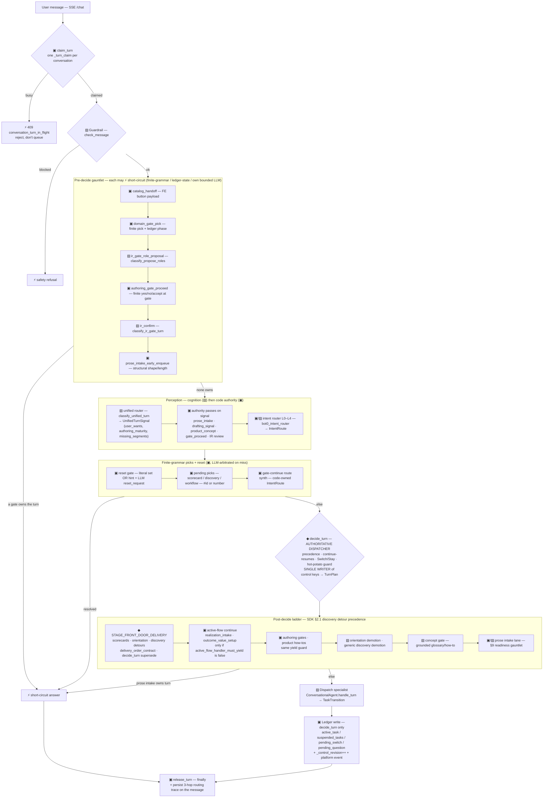
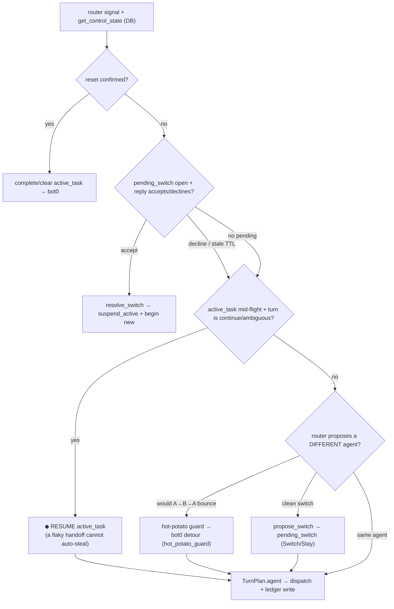
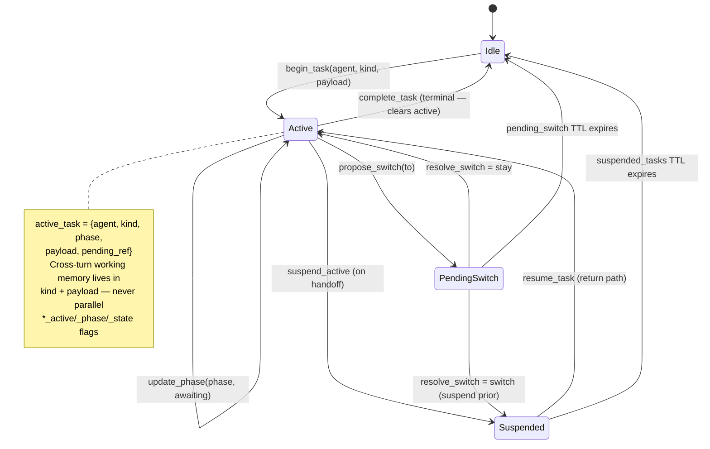
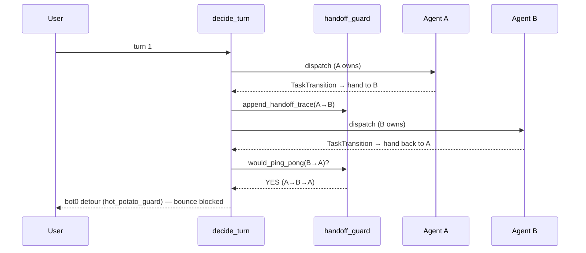
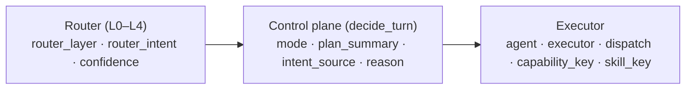

# Conversation Turn Lifecycle — the ledger-pinned flow

**What this is.** A single map of one chat turn through **your host entrypoint** (HTTP handler, SSE `chat`, worker) and the portable `conversation_control/` package. Bot0's reference host is `api/services/host chat module (monorepo)::chat` — **monorepo only**, not shipped here. The diagram shows where perception, `decide_turn`, detours, and ledger writes belong.

**Honest framing.** This documents the flow **as it is**, not the idealized "one router → `decide_turn`" version
in the [SDK contract](conversation-control-plane-sdk.md). The pre-decide **gauntlet** is real: several fast-paths
and detours can short-circuit before `decide_turn` runs. Retiring that competition (detours → ledger tasks, one
authoritative decision) is the  work;
this diagram is the honest baseline it works against.

**Ownership (2026-07-09).** Who manages memory vs front door vs multi-agent ownership is **not** siloed in this
diagram alone — see [SDK §0.1.2](conversation-control-plane-sdk.md#012-who-owns-what--front-door-multi-agent-ownership-memory-expectations)
and .

**One-liner:** *The ledger is the control plane’s state of record; the control plane is the rules and code
that read/write that state and pick the delivery leaf — one meta-layer, not two products.*

**Rule:** host short-circuits that ignore sealed `task_intent` / exclusive owner (e.g. early cost sole-continue)
are **control-plane delivery bugs**, not agent tool-choice bugs.

**Multi-turn sole-continue (does not change this diagram’s stage order):** once
`active_task.kind` is a sole-continue stream and an entity is **pinned**, later turns stay on the same
path — **phase-gated** entity resolve, **ledger pins** for identity, **LLM** for continue meaning
([SDK §2.1 multi-turn stream](conversation-control-plane-sdk.md#21-multi-turn-stream-contract-every-sole-continue-kind)).
This is dispatch discipline inside active-flow continue, not a second state machine.

**Cognition / execution on this map (2026-07-07).** ▨ blocks emit labels (intent, `user_wants`,
`authoring_maturity`, gaps). ▣ blocks validate enums and run transitions. **Semantic readiness** (how good is
this prose?) is ▨→▣ via `enrich_intake_assessment` — rubric in the published classifier prompt, execution in
code (,
[SDK §11.4](conversation-control-plane-sdk.md#114-classifier-rubric-ownership-prompt-library-pattern)). **Structural
readiness** (SQL counts, IR validators, finite step-list shape) stays ▣ throughout.

---

## 1. The turn lifecycle (top to bottom)

Legend: **▨ = LLM cognition** · **▣ = code / finite-grammar / ledger-state** · **⚡ = short-circuit exit (skips
`decide_turn`)** · **◆ = the single authoritative decision**.

**Reading it:** perception (guardrail + unified router + intent router) only *proposes*. The gauntlet and the
finite picks can answer the turn themselves (⚡) — that's the competition. When none of them own the turn,
`decide_turn` (◆) is the one place that reads the ledger, applies precedence, and **writes** the control keys.
Every path — short-circuit or full — ends by releasing the claim and persisting the routing trace.

---

## 2. Perception — the intent router (L0–L4)

Cheapest signal first; the LLM (L3) is the arbiter for anything genuinely ambiguous. Layers are precedence
stages inside `bot0_intent_router.py`, surfaced in every routing trace as `layer`.

> `decide_turn` may still **override** the router's live route (precedence, continue, hot-potato). The trace then
> shows `layer: turn_plan:<mode>`.

---

## 3. `decide_turn` — the authoritative decision

The single writer. It takes the router signal + the DB-authoritative ledger and returns a `TurnPlan`; the ledger
write is its exclusive right (specialists only *declare* `TaskTransition`).

Precedence in one line: **reset > switch-reply > continue-resumes > hot-potato-guard > propose-switch >
same-agent dispatch.** "Continue resumes" beating a flaky handoff classifier is the load-bearing invariant
(§5/§6 of the SDK contract).

---

## 4. The ledger state model (what "ledger-pinned" means)

The control slice lives on `conversations.context` (JSONB). `_CONTROL_KEYS`
([ledger.py:274](../../api/services/conversation_control/ledger.py#L274)) = `active_task`, `suspended_tasks`,
`pending_switch`, `pending_question` (+ transitional `advisor_active` / `pipeline_step` / `create_flow_state`,
being retired). Meta fields: `_control_revision` (monotonic), `_turn_claim` (holder + heartbeat + TTL),
`_handoff_trace` (bookkeeping, not a control key).

Every write bumps `_control_revision` and emits a platform event, so "why did routing choose X, and when?" is a
SQL query, not a graph-checkpoint deserialization. Finite picks (numbered menus) live in `pending_question`, not
free-text re-inference.

---

## 5. The hot-potato (ping-pong) guard

A→B→A bounce burns tokens and confuses users. `handoff_guard.py` records `_handoff_trace` and `decide_turn`
blocks the immediate bounce back.

Complementary guards on the same class of loop: Switch/Stay confirmation (no silent bounce), `suspend_active`
(a return path without re-inferring from text), and `pending_switch` TTL (stale offers expire).

---

## 6. The three-hop routing trace (observability)

Every turn persists one trace object (`route_data.routing` on the message; also streamed live and carried on
async-job results). This is the ledger's audit companion.

A short-circuit exit shows up as `plan_summary: 'Skipped decide_turn; <dispatch> short-circuit'` — the literal
fingerprint of the gauntlet competing with the authoritative decision.

---

## 7. Stage → portable anchor

> **Bot0 reference:** the monorepo diagram maps these stages to `api/services/host chat module (monorepo)::chat` line anchors
> for internal debugging. Adopters implement the **same stage order** in their host entrypoint; only
> `conversation_control/` modules in `reference/` are portable.

| Stage | Portable anchor | Kind |
|---|---|---|
| Turn claim / release | `ledger.claim_turn` / `release_turn` / `renew_turn_claim` | ▣ serialize |
| Guardrail | **Your** HTTP/chat boundary (auth, rate limit, safety) | ▨ safety |
| Pre-decide gauntlet | **Your** application layer (optional finite picks / gates) | ▣/▨ ⚡ |
| Unified router signal | **Your** bounded classifier → enums | ▨ perception |
| Router authority passes | `apply_unified_router_authorities` pattern (host-owned) | ▣ execution on signal |
| **decide_turn** | `decide.decide_turn` | ◆ authoritative |
| **Front-door delivery** | `delivery_order_contract` + host dispatch | ◆/▣ — **before** active-flow continue |
| Active-flow continue | Specialist `handle_turn` paths | ▣ — gated by `active_flow_handler_must_yield()` |
| Post-decide detours | Host discovery/orientation handlers | ▨/▣ |
| Ledger control keys | `ledger.py` | ▣ state |
| Hot-potato guard | `handoff_guard.py` | ▣ |
| Routing trace | `route_data.routing` per [SDK §11.1](conversation-control-plane-sdk.md#111-intent-router-layers-l0l4-and-per-turn-routing-trace) | observability |

---

## 8. The one thing to keep true

`decide_turn` (◆) is the **single writer** of the control keys and the **sole authoritative dispatcher**. Every ⚡
short-circuit in §1 that answers a turn *without* passing through it is a competing arbiter — acceptable only when
it (a) reads ledger/finite-grammar/structured state, not free-text meaning, and (b) leaves the ledger consistent.
The map exists so new fast-paths are added with eyes open: a detour that decides meaning and skips `decide_turn`
is the bug class (`Skipped decide_turn` traces, stale mirrors, orientation loops) this whole layer is hardening
against.

**2026-07-08 addendum — discovery detour precedence.** [SDK §2.1 discovery detour precedence](conversation-control-plane-sdk.md#discovery-detour-precedence-delivery-order-invariant):
`decide_turn` supersedes active guided flows when `discovery_kind` ∈ `FRONT_DOOR_DETOUR_KINDS`;
the chat entrypoint delivers front-door answers (`STAGE_FRONT_DOOR_DELIVERY`) **before**
ledger-first continuations. New handlers must call `active_flow_handler_must_yield()` — not
ad-hoc `_plan_mode != "detour"` copies. Ratchet: `test_delivery_order_contract.py`.

**2026-07-08 addendum — grounded glossary / concept gate (CAQ-15).** [SDK §2.1 grounded glossary](conversation-control-plane-sdk.md#grounded-glossary--concept-gate-mid-authoring-detour--caq-15):
retrieval-grounded definitional asks deliver via `concept_gate` on the post-decide ladder
(`DETOUR_DELIVERY_ORDER_TABLE` row `concept_gate`) **before** resume/orientation, scorecards
inventory, and prose intake. Render: `glossary_concept` block + code-owned intro.

**Readiness is not one thing.** Semantic intake readiness belongs in ▨; shape rubrics are ▣ fail-soft fallback only when the router did not assess — see [SDK §11.4](conversation-control-plane-sdk.md#114-classifier-rubric-ownership-prompt-library-pattern).

---

## 9. Host-specific intake (monorepo detail)

Bot0's prose-intake and readiness merge (`enrich_intake_assessment`, `apply_strength_rubric`, …) live in the
monorepo host — not in the portable `reference/` slice. Adopters: **semantic readiness in classifiers** (▨),
**gates/transitions in code** (▣); see [SDK §11.4](conversation-control-plane-sdk.md#114-classifier-rubric-ownership-prompt-library-pattern)
and [SDK §2.1](conversation-control-plane-sdk.md#21-integration-guardrails-portable-contract).

---

## 10. Is this a LangGraph? (honest answer)

**Semantics, not a framework mandate.** The diagrams describe control-plane behavior you can implement
imperatively (`decide.py` + `ledger.py` in `reference/`) or optionally host as LangGraph nodes later — the
**contract** (single writer, cognition → execution split, explicit ledger state) stays the same.

| Layer | This SDK | LangGraph (optional) |
|---|---|---|
| **Control plane** (who owns the turn?) | Ledger + `decide_turn` precedence | Optional meta-graph host — [SDK §14](conversation-control-plane-sdk.md#14-ecosystem-layering--langgraph-crewai-temporal-and-the-control-plane) |
| **Perception** | Bounded classifiers → enums | Classifier **nodes** — same contract either way |
| **Specialist agents** | `ConversationalAgent` under dispatch | Subgraphs / crews — Layer 1 execution |
| **Checkpoints** | `control_revision` + routing trace | Mid-agent checkpointer — **orthogonal** (run replay ≠ Switch/Stay) |

Load-bearing rules: (1) one writer of control keys (`decide_turn`); (2) ▨ labels, ▣ transitions
([SDK §2.1](conversation-control-plane-sdk.md#21-integration-guardrails-portable-contract)); (3) explicit ledger
state, not parallel context flags.

**Compose, don't replace:** LangGraph for **agent internals**; ledger + `decide_turn` for **cross-agent ownership**
([SDK §14](conversation-control-plane-sdk.md#14-ecosystem-layering--langgraph-crewai-temporal-and-the-control-plane)).
