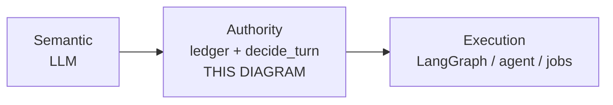
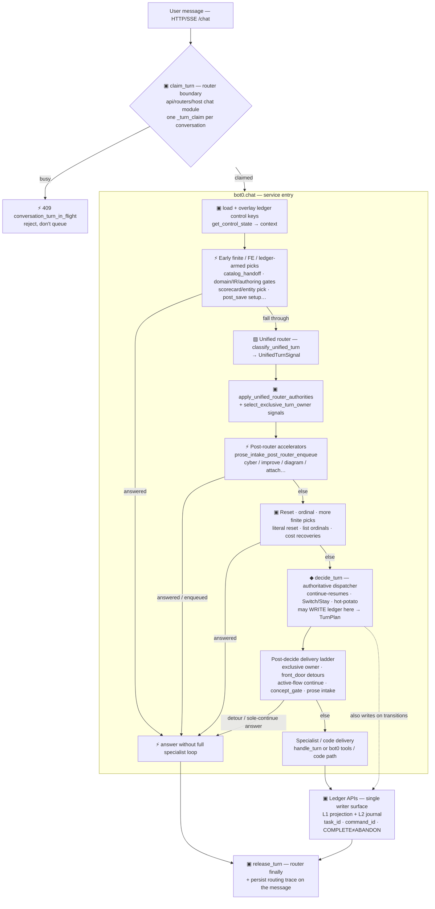
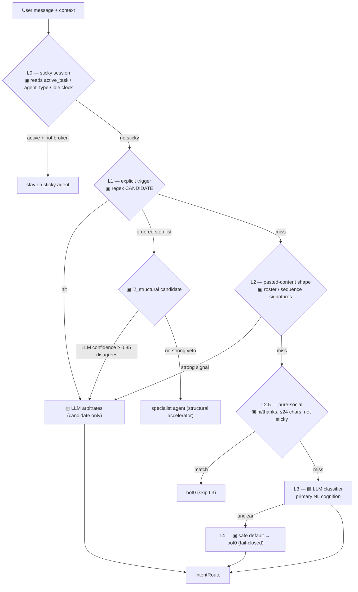
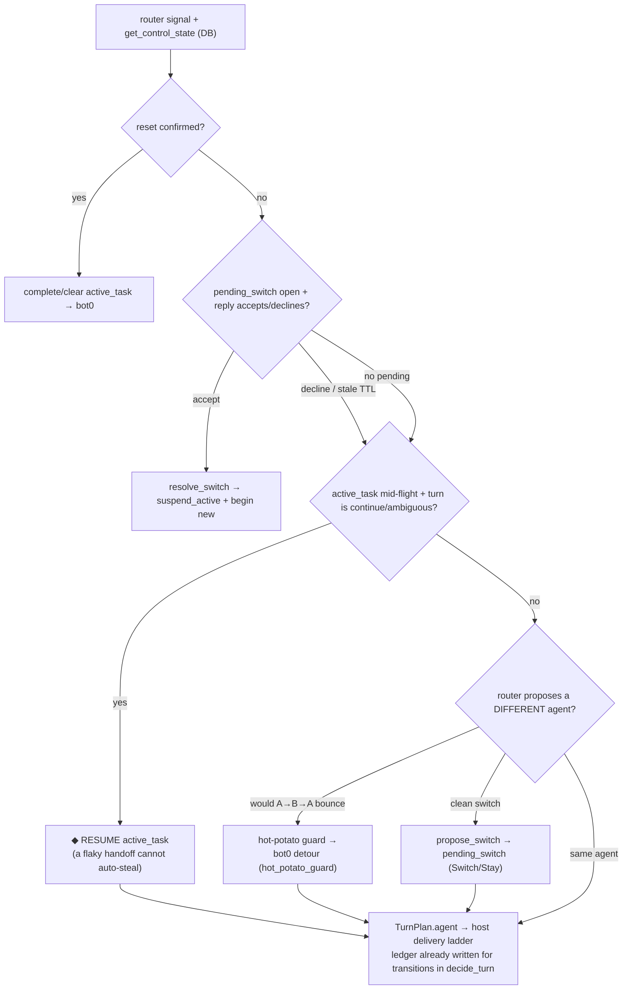
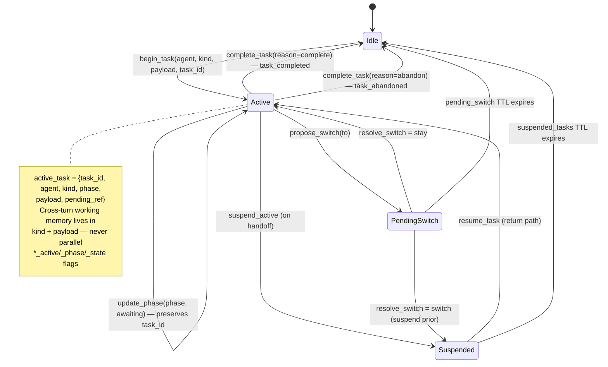
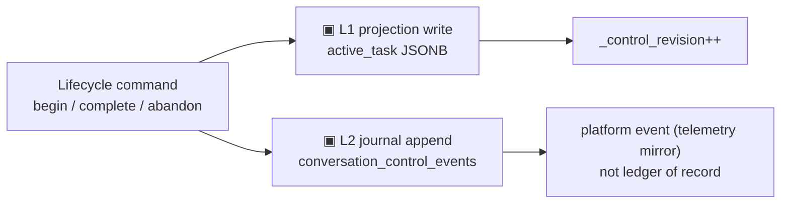
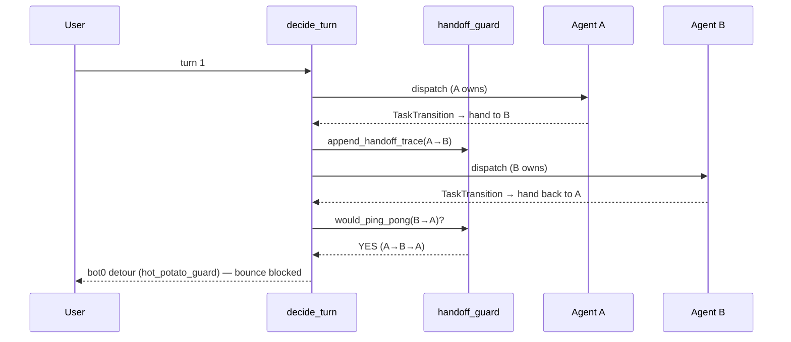
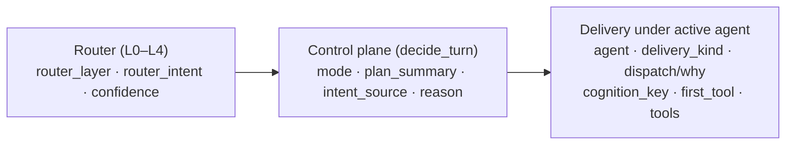

# Conversation Turn Lifecycle — the ledger-pinned flow

**What this is.** A single, code-grounded map of one chat turn for **Bot0 the product host**: HTTP/SSE entry
(`api/routers/host chat module`) → `api/services/host chat module::chat` → `conversation_control/`. It shows where
perception, short-circuits, `decide_turn`, delivery, and ledger writes happen.

### Gauntlet vs ledger (do not conflate)

| Layer | What it is | Who owns it |
|---|---|---|
| **Ledger + `decide_turn`** | Portable **control plane** — claim, projection, journal, single writer, phase/pin gates | **Conversation Control Plane SDK** |
| **Gauntlet** | Bot0 **orchestrator / host** choices around that plane — pre- and post-`decide_turn` short-circuits, unified-router wiring, prose-intake readiness, product delivery leaves | **Bot0 product** (`bot0.chat`), **not** the ledger schema |

The gauntlet was **our product decision** to harden multi-agent chat quality and delivery order. It is **not**
required by the control plane contract. Adopters can run a thin host:

`claim → router labels → decide_turn → handle_turn → apply_transition → release`

without any Bot0-named gauntlet stages. This document maps **Bot0 host + plane together** so monorepo
debuggers see the real turn. For a **portable-only** picture (no gauntlet names), see the SDK host loop
([README On-ramp](../../extract/conversation-control-plane/README.md) / SDK §1) — a second mermaid
(**“adopter host loop only”**) can be added to the public package later without changing the ledger.

**Honest framing.** This documents Bot0 **as it is**, not the idealized portable host above. Reality is a
**gauntlet interleaved with perception**: finite/code-owned paths can answer **before** `decide_turn`; S4 made
the **unified router** the main perception hop; **post-router** prose enqueue is preferred over pre-router early
enqueue. Line anchors drift — prefer **function names** over line numbers when debugging.

**Ownership (2026-07-09).** Who manages memory vs front door vs multi-agent ownership is **not** siloed in this
diagram alone — see [SDK §0.1.2](conversation-control-plane-sdk.md#012-who-owns-what--front-door-multi-agent-ownership-memory-expectations)
and .

**One-liner:** *The ledger is the control plane’s state of record; the control plane is the rules and code
that read/write that state and pick the delivery leaf — one meta-layer, not two products.*

**Where this sits in the ecosystem** ([SDK §0](conversation-control-plane-sdk.md#0-value-proposition--conversational-control-in-a-layered-stack) ·
[§14](conversation-control-plane-sdk.md#14-ecosystem-layering--langgraph-crewai-temporal-and-the-control-plane)):
conversational **authority** is **not** LangGraph state, Temporal workflow code, or agent-SDK handoffs. Those
are **execution adapters**. This diagram is one **turn** through the authority plane.

| Concern | Owner on this map |
|---|---|
| What did the user mean? | ▨ classifiers / router |
| Who owns the turn / gate / phase? | ▣ ledger + `decide_turn` |
| How does the specialist run? | Agent / graph / async job **after** dispatch |
| Retries / worker recovery | Claim TTL, jobs, infra — not graph-as-authority |

**Rule:** host short-circuits that ignore sealed `task_intent` / exclusive owner (e.g. early cost sole-continue)
are **control-plane delivery bugs**, not agent tool-choice bugs.

**Multi-turn sole-continue (does not change this diagram’s stage order):** once
`active_task.kind` is a sole-continue stream and an entity is **pinned**, later turns stay on the same
path — **phase-gated** entity resolve, **ledger pins** for identity, **LLM** for continue meaning
([SDK §2.1 multi-turn stream](conversation-control-plane-sdk.md#21-multi-turn-stream-contract-every-sole-continue-kind)).
This is dispatch discipline inside active-flow continue, not a second state machine.

**Ledger maturity — Model A L2 (2026-07-11):** the control plane has **two complementary stores**:

| Store | Authority | Shape |
|---|---|---|
| **L1 projection** | *Routing* — who owns the next turn | `conversations.context` keys (`active_task`, `suspended_tasks`, …) |
| **L2 journal** | *History* — immutable ordered transitions | `conversation_control_events` (`task_began` / `task_completed` / `task_abandoned` / …) |

Every successful lifecycle command assigns an immutable **`task_id`**, uses **`command_id`** for
idempotency, and appends a journal row in the same transaction as the projection write
(`ledger_journal.py` + `begin_task` / `complete_task` / `finish_active_task`). COMPLETE and ABANDON
are **distinct event types** — not one “clear stickiness” blob.

**Code anchors** (verified 2026-07-11 against monorepo):

| Stage | Where (prefer symbolsymbols** over lines) |
|---|---|
| Turn claim / release | `api/routers/host chat module` → `ledger.claim_turn` / `release_turn` (not inside `chat`) |
| `chat` entry | `bot0.chat` ~L10550 — ledger overlay via `get_control_state` |
| Early finite / FE | `_try_catalog_handoff_dispatch` · domain/IR/authoring gate helpers · early scorecard/entity picks |
| Perception | `classify_unified_turn` + `apply_unified_router_authorities` (~L11141+) |
| Post-router enqueue | `_try_prose_intake_post_router_enqueue_dispatch` (preferred; early is legacy alias) |
| More pre-decide | cyber / improve / reset / ordinal / cost sole-continue recoveries |
| **decide_turn** | `decide.decide_turn` via `bot0.chat` ~L12373 — may **write** ledger mid-call |
| Exclusive owner + front door | `select_exclusive_turn_owner` · `front_door_detour_supersedes_active_flow` (~L12512+) |
| Ledger APIs | `ledger.begin_task` / `update_phase` / `complete_task` / `finish_active_task` + journal |
| Hot-potato | `handoff_guard.would_ping_pong` (inside `decide_turn`) |

**Cognition / execution on this map (2026-07-07).** ▨ blocks emit labels (intent, `user_wants`,
`authoring_maturity`, gaps). ▣ blocks validate enums and run transitions. **Semantic readiness** (how good is
this prose?) is ▨→▣ via `enrich_intake_assessment` — rubric in the published classifier prompt, execution in
code (,
[SDK §11.4](conversation-control-plane-sdk.md#114-classifier-rubric-ownership-prompt-library-pattern)). **Structural
readiness** (SQL counts, IR validators, finite step-list shape) stays ▣ throughout.

---

## 1. The turn lifecycle (top to bottom)

Legend: **▨ = LLM cognition** · **▣ = code / finite-grammar / ledger-state** · **⚡ = short-circuit (may skip
`decide_turn`)** · **◆ = authoritative dispatch decision**.

> **Accuracy notes (2026-07-11):** (1) **`claim_turn` / `release_turn` live on the HTTP/SSE router**, not
> inside `chat`. (2) Pre-decide short-circuits are **interleaved** with unified-router perception — not one
> pure block of gates then one pure router. (3) **Primary** rich-prose async path is
> **`prose_intake_post_router_enqueue`** (after unified router); early enqueue is a legacy alias.
> (4) **`decide_turn` may write the ledger** (begin/suspend/switch/complete) during the call — not only after
> the specialist returns. (5) S4: **unified router** is the main perception hop; L0–L4 intent router is not a
> guaranteed second serial LLM on every turn (`decide_turn` reuses `UnifiedTurnSignal` when present).

**Reading it:** finite/code-owned paths and some accelerators can ⚡ answer without `decide_turn`. Perception
**proposes** labels; `decide_turn` (◆) is still the sole **authoritative** dispatcher and the intended single
writer of control keys. Specialists **declare** transitions; host/ledger APIs apply them. Every path should
end in **release_turn** + a routing trace.

---

## 2. Perception — unified router (primary) + legacy L0–L4

**S4 (current):** normal turns run **`classify_unified_turn` → `apply_unified_router_authorities`** and pass
`UnifiedTurnSignal` into `decide_turn` (no second full intent-classifier hop for relative continue meaning).

**Legacy L0–L4** (`bot0_intent_router.py`) still exists for some paths/traces and as historical/fallback
cognition. Layers are cheapest-first; L3 is the ambiguous NL arbiter when that router runs.

> `decide_turn` may still **override** the router's live route (precedence, continue, hot-potato). The trace then
> shows `layer: turn_plan:<mode>`.

---

## 3. `decide_turn` — the authoritative decision

The single writer. It takes the router signal + the DB-authoritative ledger and returns a `TurnPlan`; the ledger
write is its exclusive right (specialists only *declare* `TaskTransition`).

Precedence in one line: **reset > switch-reply > continue-resumes > hot-potato-guard > propose-switch >
same-agent dispatch.** "Continue resumes" beating a flaky handoff classifier is the load-bearing invariant
(§5 of the SDK contract). After `decide_turn`, **host** exclusive-owner / front-door / active-flow delivery
runs (diagram §1 POST) — that is not a second writer of control keys.
---

## 4. The ledger state model (what "ledger-pinned" means)

### 4.1 L1 projection (routing authority)

The control slice lives on `conversations.context` (JSONB). `_CONTROL_KEYS` /
`LEDGER_CONTROL_KEYS` ([ledger_keys.py](../reference/api/services/conversation_control/ledger_keys.py)) =
`active_task`, `suspended_tasks`, `pending_switch`, `pending_question`, `plan`, `shadow_plan`
(+ transitional `advisor_active` / `pipeline_step` / `create_flow_state`, being retired).
Meta fields: `_control_revision` (monotonic), `_turn_claim` (holder + heartbeat + TTL),
`_handoff_trace` (bookkeeping, not a control key).

Every write bumps `_control_revision` and emits a platform event. Finite picks (numbered menus) live in
`pending_question`, not free-text re-inference.

### 4.2 L2 journal (historical authority — Model A)

Append-only table `conversation_control_events` ([migration `a3b4c5d6e7f8`](../reference/api/services/conversation_control/ledger_journal.py),
helpers [ledger_journal.py](../reference/api/services/conversation_control/ledger_journal.py)):

| Field | Role |
|---|---|
| `seq` | Per-conversation order |
| `command_id` | Idempotency key (unique per tenant+conversation) |
| `task_id` | Immutable task instance identity |
| `event_type` | `task_began` · `task_completed` · `task_abandoned` · `task_failed` · `task_superseded` · … |
| `control_revision_after` | Fence against the projection version |

**Adopter rule:** specialists declare `TaskTransition` / `TaskTransitionRequest` (with `task_id` +
`command_id` when known); only `decide_turn` / ledger APIs write. Prefer `finish_active_task(...)` from
first-class handlers so cancel maps to **abandon** and save maps to **complete**. "Why did routing choose X?"
is now: projection snapshot + journal sequence + routing trace — not a graph-checkpoint deserialization.

**Production-grade write path (2026-07-11):** journal append is **fail-closed** (same TX as projection);
invalid phase raises `TaskPhaseInvalidError` (no log-and-persist); outbox export runs on the **worker
idle tick** (`BG_CONTROL_OUTBOX_INTERVAL`, default 30s) — never on the chat hot path. SDK claim:
[§ Production grade](conversation-control-plane-sdk.md#production-grade-definition).

---

## 5. The hot-potato (ping-pong) guard

A→B→A bounce burns tokens and confuses users. `handoff_guard.py` records `_handoff_trace` and `decide_turn`
blocks the immediate bounce back.

Complementary guards on the same class of loop: Switch/Stay confirmation (no silent bounce), `suspend_active`
(a return path without re-inferring from text), and `pending_switch` TTL (stale offers expire).

---

## 6. The routing trace (observability)

Every turn persists one trace object (`route_data.routing` on the message; also streamed live and carried on
async-job results). This is the ledger's **audit companion**, not a second authority. Full field contract
and agent/skill/tool ontology: **[SDK §11.1](conversation-control-plane-sdk.md#111-intent-router-layers-l0l4-and-per-turn-routing-trace)** (published). Export wiring samples: [trace export](conversation-control-plane-sdk.md#111-intent-router-layers-l0l4-and-per-turn-routing-trace).

**Three-hop mental model** (still valid; delivery is richer than a single executor label):

| Concept on the strip | Meaning |
|---|---|
| **Active agent** (`agent`) | Session/turn **owner** — may fulfill via LLM+tools **or** deterministic code |
| **Cognition** (`cognition_key`) | Bounded classifier/router/extractor — **not** the owner |
| **Tools** (`first_tool`, `tools`) | Callables under that agent (or code path that is tool-shaped) |
| **Dispatch / Why** | Code-owned delivery branch when not a full specialist loop |

A short-circuit exit shows up as `plan_summary: 'Skipped decide_turn; <dispatch> short-circuit'` — the literal
fingerprint of the gauntlet competing with the authoritative decision (legal only for finite/code-owned paths).

---

## 7. Stage → portable anchor

> **Bot0 reference:** the monorepo diagram maps these stages to `api/services/host chat module (monorepo)::chat` line anchors
> for internal debugging. Adopters implement the **same stage order** in their host entrypoint; only
> `conversation_control/` modules in `reference/` are portable.

| Stage | Portable anchor | Kind |
|---|---|---|
| Turn claim / release | `ledger.claim_turn` / `release_turn` / `renew_turn_claim` | ▣ serialize |
| Guardrail | **Your** HTTP/chat boundary (auth, rate limit, safety) | ▨ safety |
| Pre-decide gauntlet | **Your** application layer (optional finite picks / gates) | ▣/▨ ⚡ |
| Unified router signal | **Your** bounded classifier → enums | ▨ perception |
| Router authority passes | `apply_unified_router_authorities` pattern (host-owned) | ▣ execution on signal |
| **decide_turn** | `decide.decide_turn` | ◆ authoritative |
| **Front-door delivery** | `delivery_order_contract` + host dispatch | ◆/▣ — **before** active-flow continue |
| Active-flow continue | Specialist `handle_turn` paths | ▣ — gated by `active_flow_handler_must_yield()` |
| Post-decide detours | Host discovery/orientation handlers | ▨/▣ |
| Ledger control keys | `ledger.py` | ▣ state |
| Hot-potato guard | `handoff_guard.py` | ▣ |
| Routing trace | `route_data.routing` per [SDK §11.1](conversation-control-plane-sdk.md#111-intent-router-layers-l0l4-and-per-turn-routing-trace) | observability |

---

## 8. The one thing to keep true

`decide_turn` (◆) is the **single writer** of the control keys and the **sole authoritative dispatcher**. Every ⚡
short-circuit in §1 that answers a turn *without* passing through it is a competing arbiter — acceptable only when
it (a) reads ledger/finite-grammar/structured state, not free-text meaning, and (b) leaves the ledger consistent.
The map exists so new fast-paths are added with eyes open: a detour that decides meaning and skips `decide_turn`
is the bug class (`Skipped decide_turn` traces, stale mirrors, orientation loops) this whole layer is hardening
against.

**2026-07-08 addendum — discovery detour precedence.** [SDK §2.1 discovery detour precedence](conversation-control-plane-sdk.md#discovery-detour-precedence-delivery-order-invariant):
`decide_turn` supersedes active guided flows when `discovery_kind` ∈ `FRONT_DOOR_DETOUR_KINDS`;
the chat entrypoint delivers front-door answers (`STAGE_FRONT_DOOR_DELIVERY`) **before**
ledger-first continuations. New handlers must call `active_flow_handler_must_yield` — not
ad-hoc `_plan_mode != "detour"` copies. Ratchet: `test_delivery_order_contract.py`.

**2026-07-08 addendum — grounded glossary / concept gate (CAQ-15).** [SDK §2.1 grounded glossary](conversation-control-plane-sdk.md#grounded-glossary--concept-gate-mid-authoring-detour--caq-15):
retrieval-grounded definitional asks deliver via `concept_gate` on the post-decide ladder
(`DETOUR_DELIVERY_ORDER_TABLE` row `concept_gate`) **before** resume/orientation, scorecards
inventory, and prose intake. Render: `glossary_concept` block + code-owned intro.

**Readiness is not one thing.** Semantic intake readiness belongs in ▨; shape rubrics are ▣ fail-soft fallback only when the router did not assess — see [SDK §11.4](conversation-control-plane-sdk.md#114-classifier-rubric-ownership-prompt-library-pattern).

---

## 9. Host-specific intake (monorepo detail)

Bot0's prose-intake and readiness merge (`enrich_intake_assessment`, `apply_strength_rubric`, …) live in the
monorepo host — not in the portable `reference/` slice. Adopters: **semantic readiness in classifiers** (▨),
**gates/transitions in code** (▣); see [SDK §11.4](conversation-control-plane-sdk.md#114-classifier-rubric-ownership-prompt-library-pattern)
and [SDK §2.1](conversation-control-plane-sdk.md#21-integration-guardrails-portable-contract).

---

## 10. Is this a LangGraph? (honest answer)

**Semantics, not a framework mandate.** The diagrams describe control-plane behavior you can implement
imperatively (`decide.py` + `ledger.py` in `reference/`) or optionally host as LangGraph nodes later — the
**contract** (single writer, cognition → execution split, explicit ledger state) stays the same.

| Layer | This SDK | LangGraph (optional) |
|---|---|---|
| **Control plane** (who owns the turn?) | Ledger + `decide_turn` precedence | Optional meta-graph host — [SDK §14](conversation-control-plane-sdk.md#14-ecosystem-layering--langgraph-crewai-temporal-and-the-control-plane) |
| **Perception** | Bounded classifiers → enums | Classifier **nodes** — same contract either way |
| **Specialist agents** | `ConversationalAgent` under dispatch | Subgraphs / crews — Layer 1 execution |
| **Checkpoints** | `control_revision` + routing trace | Mid-agent checkpointer — **orthogonal** (run replay ≠ Switch/Stay) |

Load-bearing rules: (1) one writer of control keys (`decide_turn`); (2) ▨ labels, ▣ transitions
([SDK §2.1](conversation-control-plane-sdk.md#21-integration-guardrails-portable-contract)); (3) explicit ledger
state, not parallel context flags.

**Compose, don't replace:** LangGraph for **agent internals**; ledger + `decide_turn` for **cross-agent ownership**
([SDK §14](conversation-control-plane-sdk.md#14-ecosystem-layering--langgraph-crewai-temporal-and-the-control-plane)).
