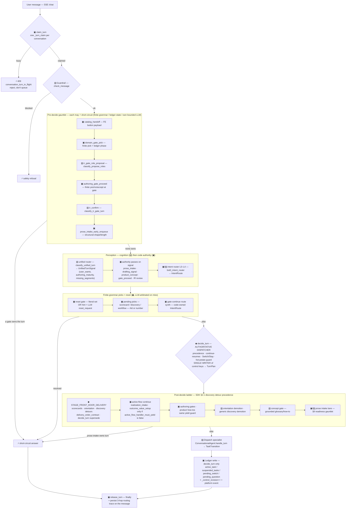
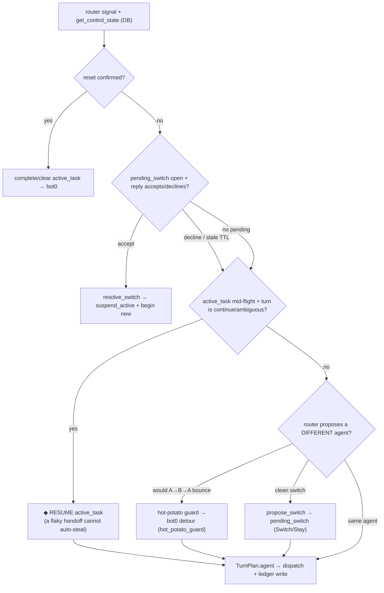
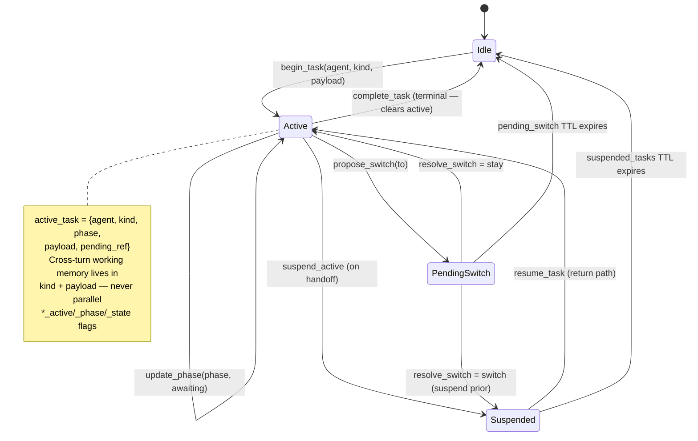
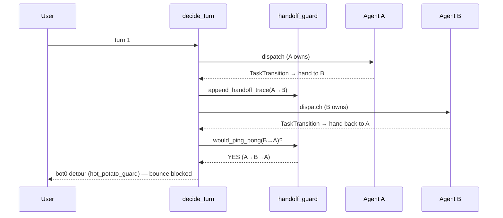
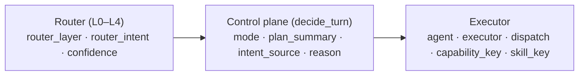
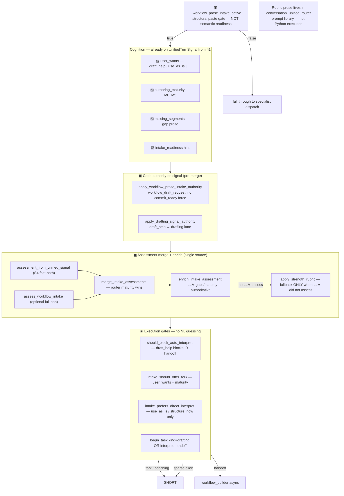

# Conversation Turn Lifecycle — the ledger-pinned flow

**Canonical architecture (4 of 4).** Part of the four-document set with the [SDK](conversation-control-plane-sdk.md),
Bot0 implementation playbook (monorepo only), and
. Index:
.

**What this is.** A single, code-accurate map of one chat turn through `api/services/bot0.py::chat` and the
`conversation_control/` package. It shows *exactly* where intent classification, routing, decisioning, detouring,
and hot-potato handling happen — and where the **ledger** is read and written, which is what makes the flow a
real capability rather than a stateless prompt chain.

**Honest framing.** This documents the flow **as it is**, not the idealized "one router → `decide_turn`" version
in the [SDK contract](conversation-control-plane-sdk.md). The pre-decide **gauntlet** is real: several fast-paths
and detours can short-circuit before `decide_turn` runs. Retiring that competition (detours → ledger tasks, one
authoritative decision) is the  work;
this diagram is the honest baseline it works against.

**Code anchors** (2026-07-07): `chat()` [bot0.py:6071](../../api/services/bot0.py#L6071) · guardrail
[:6131](../../api/services/bot0.py#L6131) · pre-decide gauntlet [:6333–6430](../../api/services/bot0.py#L6333) ·
unified router + authority passes [:6461–6505](../../api/services/bot0.py#L6461) · `decide_turn`
[:7447](../../api/services/bot0.py#L7447) · prose intake / readiness path [:8183](../../api/services/bot0.py#L8183) ·
post-decide detours [:7520–7608](../../api/services/bot0.py#L7520). Ledger
[ledger.py:274](../../api/services/conversation_control/ledger.py#L274) · hot-potato
[handoff_guard.py](../../api/services/conversation_control/handoff_guard.py) · intake maturity
[intake_maturity.py](../../api/services/conversation_control/intake_maturity.py) · enrich intake
[workflow_intake.py](../../api/services/conversation_control/workflow_intake.py).

**Cognition / execution on this map (2026-07-07).** ▨ blocks emit labels (intent, `user_wants`,
`authoring_maturity`, gaps). ▣ blocks validate enums and run transitions. **Semantic readiness** (how good is
this prose?) is ▨→▣ via `enrich_intake_assessment` — rubric in the published classifier prompt, execution in
code (,
[SDK §11.4](conversation-control-plane-sdk.md#114-classifier-rubric-ownership-prompt-library-pattern)). **Structural
readiness** (SQL counts, IR validators, finite step-list shape) stays ▣ throughout.

---

## 1. The turn lifecycle (top to bottom)

Legend: **▨ = LLM cognition** · **▣ = code / finite-grammar / ledger-state** · **⚡ = short-circuit exit (skips
`decide_turn`)** · **◆ = the single authoritative decision**.

**Reading it:** perception (guardrail + unified router + intent router) only *proposes*. The gauntlet and the
finite picks can answer the turn themselves (⚡) — that's the competition. When none of them own the turn,
`decide_turn` (◆) is the one place that reads the ledger, applies precedence, and **writes** the control keys.
Every path — short-circuit or full — ends by releasing the claim and persisting the routing trace.

---

## 2. Perception — the intent router (L0–L4)

Cheapest signal first; the LLM (L3) is the arbiter for anything genuinely ambiguous. Layers are precedence
stages inside `bot0_intent_router.py`, surfaced in every routing trace as `layer`.

> `decide_turn` may still **override** the router's live route (precedence, continue, hot-potato). The trace then
> shows `layer: turn_plan:<mode>`.

---

## 3. `decide_turn` — the authoritative decision

The single writer. It takes the router signal + the DB-authoritative ledger and returns a `TurnPlan`; the ledger
write is its exclusive right (specialists only *declare* `TaskTransition`).

Precedence in one line: **reset > switch-reply > continue-resumes > hot-potato-guard > propose-switch >
same-agent dispatch.** "Continue resumes" beating a flaky handoff classifier is the load-bearing invariant
(§5/§6 of the SDK contract).

---

## 4. The ledger state model (what "ledger-pinned" means)

The control slice lives on `conversations.context` (JSONB). `_CONTROL_KEYS`
([ledger.py:274](../../api/services/conversation_control/ledger.py#L274)) = `active_task`, `suspended_tasks`,
`pending_switch`, `pending_question` (+ transitional `advisor_active` / `pipeline_step` / `create_flow_state`,
being retired). Meta fields: `_control_revision` (monotonic), `_turn_claim` (holder + heartbeat + TTL),
`_handoff_trace` (bookkeeping, not a control key).

Every write bumps `_control_revision` and emits a platform event, so "why did routing choose X, and when?" is a
SQL query, not a graph-checkpoint deserialization. Finite picks (numbered menus) live in `pending_question`, not
free-text re-inference.

---

## 5. The hot-potato (ping-pong) guard

A→B→A bounce burns tokens and confuses users. `handoff_guard.py` records `_handoff_trace` and `decide_turn`
blocks the immediate bounce back.

Complementary guards on the same class of loop: Switch/Stay confirmation (no silent bounce), `suspend_active`
(a return path without re-inferring from text), and `pending_switch` TTL (stale offers expire).

---

## 6. The three-hop routing trace (observability)

Every turn persists one trace object (`route_data.routing` on the message; also streamed live and carried on
async-job results). This is the ledger's audit companion.

A short-circuit exit shows up as `plan_summary: 'Skipped decide_turn; <dispatch> short-circuit'` — the literal
fingerprint of the gauntlet competing with the authoritative decision.

---

## 7. Stage → code anchor

| Stage | Where | Kind |
|---|---|---|
| Turn claim / release | `ledger.claim_turn` / `release_turn` / `renew_turn_claim` | ▣ serialize |
| Guardrail | [bot0.py:6131](../../api/services/bot0.py#L6131) `check_message` | ▨ safety |
| Pre-decide gauntlet | [bot0.py:6333–6406](../../api/services/bot0.py#L6333) (`_try_catalog_handoff` → `_try_prose_intake_early_enqueue`) | ▣/▨ ⚡ |
| Unified router | [bot0.py:6461](../../api/services/bot0.py#L6461) `classify_unified_turn` | ▨ perception |
| Router authority passes | [bot0.py:6476–6505](../../api/services/bot0.py#L6476) `apply_*_authority` | ▣ execution on signal |
| Intent router L0–L4 | `bot0_intent_router.py` (`_structural_builder_route_or_llm_veto`) | ▣/▨ perception |
| Prose intake + readiness | [bot0.py:8183](../../api/services/bot0.py#L8183); `enrich_intake_assessment` | ▨ labels → ▣ gates |
| Finite picks + reset | pending picks [bot0.py:6834–6903](../../api/services/bot0.py#L6834); reset `reset_commands.py` | ▣ ⚡ |
| **decide_turn** | [bot0.py:7432](../../api/services/bot0.py#L7432) → `decide.py::decide_turn` | ◆ authoritative |
| **Front-door delivery** | [bot0.py](../../api/services/bot0.py) post-`decide_turn` · `delivery_order_contract.py` | ◆/▣ — **before** active-flow continue |
| Active-flow continue | `realization_intake` / `outcome_value_setup` handlers | ▣ — gated by `active_flow_handler_must_yield()` |
| Post-decide detours | orientation demotion · discovery demotion · concept gate · prose intake | ▨/▣ |
| Ledger control keys | [ledger.py:274](../../api/services/conversation_control/ledger.py#L274) | ▣ state |
| Hot-potato guard | [handoff_guard.py](../../api/services/conversation_control/handoff_guard.py) `would_ping_pong` | ▣ |
| Routing trace | `route_data.routing` (`Bot0RoutingTrace`) | observability |

---

## 8. The one thing to keep true

`decide_turn` (◆) is the **single writer** of the control keys and the **sole authoritative dispatcher**. Every ⚡
short-circuit in §1 that answers a turn *without* passing through it is a competing arbiter — acceptable only when
it (a) reads ledger/finite-grammar/structured state, not free-text meaning, and (b) leaves the ledger consistent.
The map exists so new fast-paths are added with eyes open: a detour that decides meaning and skips `decide_turn`
is the bug class (`Skipped decide_turn` traces, stale mirrors, orientation loops) this whole layer is hardening
against.

**2026-07-08 addendum — discovery detour precedence.** [SDK §2.1 discovery detour precedence](conversation-control-plane-sdk.md#discovery-detour-precedence-delivery-order-invariant):
`decide_turn` supersedes active guided flows when `discovery_kind` ∈ `FRONT_DOOR_DETOUR_KINDS`;
the chat entrypoint delivers front-door answers (`STAGE_FRONT_DOOR_DELIVERY`) **before**
ledger-first continuations. New handlers must call `active_flow_handler_must_yield()` — not
ad-hoc `_plan_mode != "detour"` copies. Ratchet: `test_delivery_order_contract.py`.

**2026-07-07 addendum — readiness is not one thing.** 
names three readiness flavors across prose → intake → IR → sim → deploy. Only **semantic** intake readiness (how rich is the description?) belongs
in ▨. Shape rubrics (`apply_strength_rubric`) are **fail-soft fallback** when the router did not assess — they must
not discard `authoring_maturity` / `missing_segments` from the unified router.

---

## 9. Prose intake + readiness gauntlet (post-`decide_turn`)

Opens when `_workflow_prose_intake_active` is true **after** `decide_turn` (typically `effective_intent != workflow_builder`,
`workflow_draft_request` or structural paste gate). This is **not** the same as pre-decide `prose_intake_early_enqueue`
(▣ structural shape/length only — async enqueue accelerator).

| Step | Module | Cognition vs execution |
|---|---|---|
| Paste is workflow-shaped | `_workflow_prose_intake_active` | ▣ structural gate (length/shape) |
| User intent this turn | `UnifiedTurnSignal.user_wants` | ▨ classifier rubric → ▣ `safe_user_wants` |
| Content maturity | `authoring_maturity` + `missing_segments` | ▨ rubric → ▣ `readiness_from_authoring_maturity` |
| Override product detour | `apply_workflow_prose_intake_authority` | ▣ clears how-to; sets `workflow_draft_request` |
| Block auto-IR | `should_block_auto_interpret` | ▣ policy on LLM label |
| Fallback rubric | `apply_strength_rubric` | ▣ only when `assess_source != llm` |

Regression pins: `test_cognition_execution_readiness_gauntlet.py`, `test_intake_maturity_routing_contract.py`.

---

## 10. Is this a LangGraph? (honest answer)

**The diagrams describe semantics, not a framework choice.** Bot0's control plane is already a **state machine**
(§4 ledger `stateDiagram`) plus a **deterministic dispatcher** (`decide_turn` flowchart in §3). It was built
imperatively — `bot0.chat()` gauntlet, `decide.py`, `ledger.py` — through production incidents, not by drawing
LangGraph first.

| Layer | Today | LangGraph? |
|---|---|---|
| **Control plane** (who owns the turn?) | Ledger JSONB + `decide_turn` precedence | *Optional future* meta-graph host ([future-state-langgraph-migration.md](future-state-langgraph-migration.md) **target**, not required) |
| **Perception** | Bounded classifiers → enums | Classifier **nodes** — same contract either way |
| **Specialist agents** | Heterogeneous (while-loop, FSM, StateGraph) | Workflow builder already uses LangGraph **internally**; advisor uses while-loop |
| **Checkpoints** | `_control_revision` + DB context + routing trace | LangGraph checkpointer answers a *different* question (run replay), not Switch/Stay precedence |

**Provocation you named is partly right:** we did assemble graph-shaped behavior backwards — gauntlet layers,
ledger states, readiness gates — and the diagrams make that visible. **That does not mean the control plane must
become a LangGraph StateGraph to be correct.** The load-bearing contract is:

1. **One writer** of control keys (`decide_turn`).
2. **Cognition → execution split** (▨ labels, ▣ transitions) — [SDK §2.1](conversation-control-plane-sdk.md#21-integration-guardrails-portable-contract).
3. **Explicit state** on the ledger, not implicit flags.

LangGraph could **host** the meta-graph later (supervisor node ≈ `decide_turn`, classifier node ≈ unified router)
while preserving the same precedence rules as product IP. Until then, these mermaid diagrams *are* the state
graph — expressed as documentation + regression pins, not as `StateGraph` edges. Adding LangGraph without
collapsing the gauntlet would duplicate the two-state-system bug (ledger vs graph checkpoint).

**Rule of thumb:** LangGraph for **agent internals** and optional **runtime plumbing**; ledger + `decide_turn`
for **cross-agent ownership** — compose, don't replace ([SDK §14](conversation-control-plane-sdk.md#14-ecosystem-layering-compose-dont-replace)).
